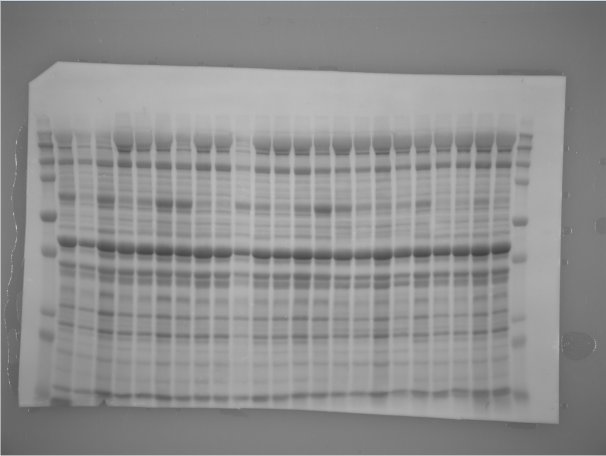
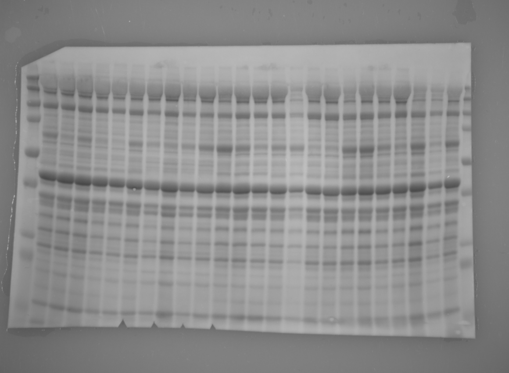
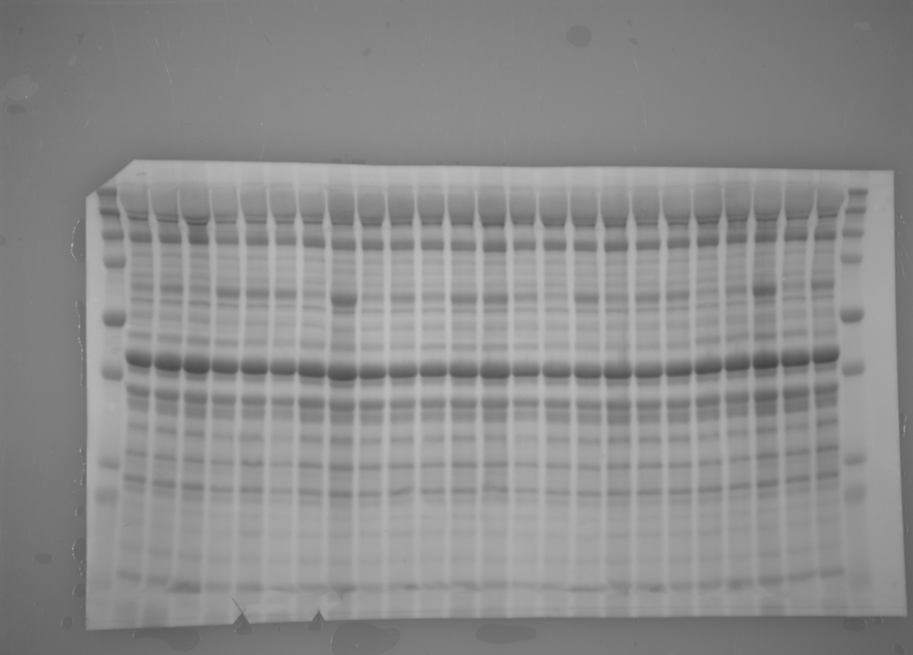
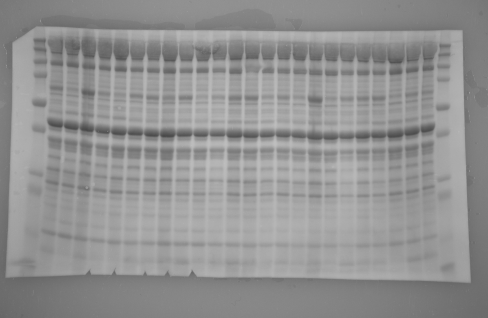
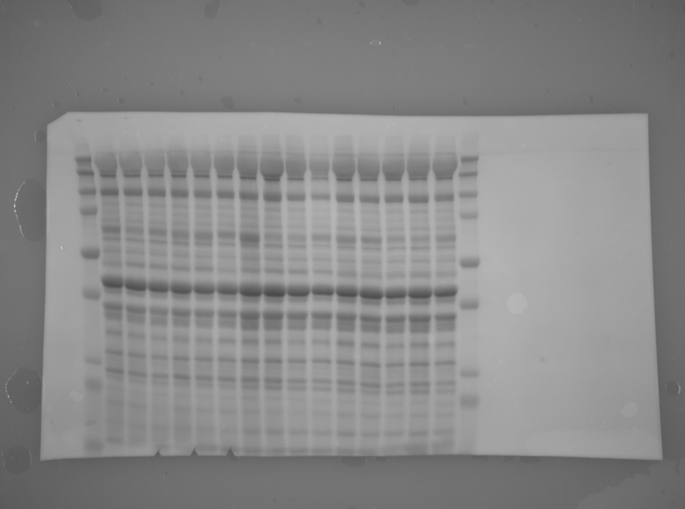
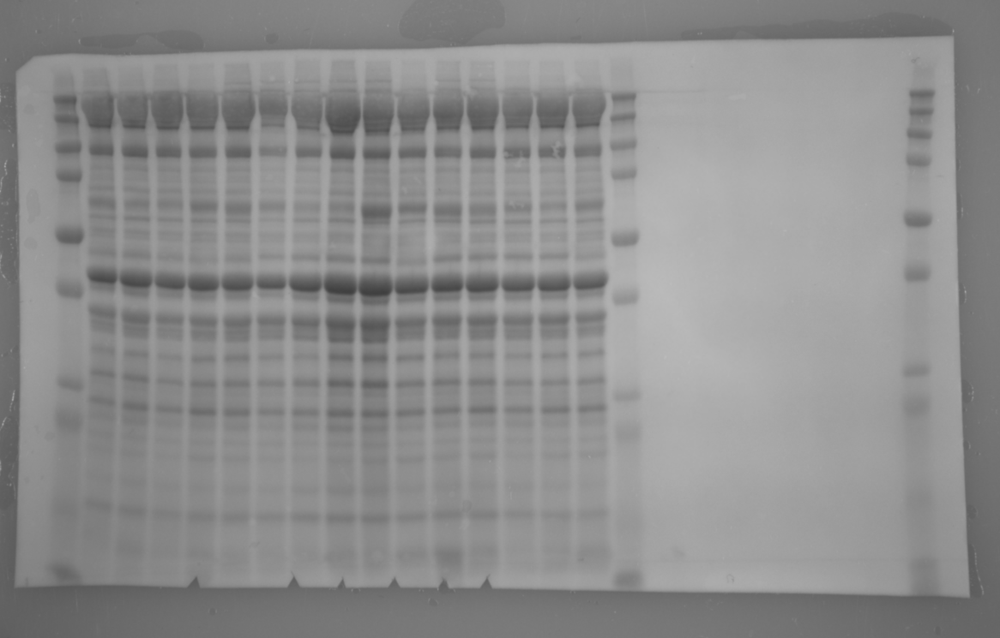

<!-- README.md is generated from README.Rmd. -->

# Extended methods: *Glucose ingestion before and after resistance training does not augment ribosome biogenesis in healthy moderately trained young adults*


## Authors

Kristian Lian
<a href="https://orcid.org/0000-0002-5169-5960">
</a>,
Daniel Hammarström
<a href="https://orcid.org/0000-0001-8360-2100">
</a>,
Håvard Hamarsland
<a href="https://orcid.org/0000-0002-7343-2774">
</a>,
Sara Christine Moen,
Stian Ellefsen
<a href="https://orcid.org/0000-0003-0467-2018">
</a>,


Section for Health and Exercise Physiology, Department of Public Health and Sport Sciences, Inland Norway University of Applied Sciences, Lillehammer, Norway.


## Abstract

**Purpose:** Muscle hypertrophy, induced by resistance training, is determined by ribosomal biogenesis. High-glucose treatment may augment the transcription of ribosomal RNA, as evident from in vitro studies. However, its effect on resistance training-induced adaptations remains unexplored.

**Methods:** Sixteen healthy, moderately trained individuals (male/female, n = 9/7; age, 23.7 (1.8)/24.6 (4.8)), participated in a within-participant trial with unilateral resistance training with glucose- and placebo supplementation on alternate days over six sessions per condition. Participants remained fasted overnight, receiving glucose/placebo and protein supplementation only before and after RT sessions (3 sets of 10 repetitions maximum unilateral leg press and knee extension). Micro biopsies were sampled from m. vastus lateralis before and after the intervention.

**Results:** Between conditions, there were no significant differences in increases of total RNA and ribosomal RNA (mean difference 7.6%, [-7.2, 24.9], p = 0.337, 47S, 37.9%, [-28.4, 131.6], p = 0.400; 18S, -7.6%, [-34.0, 29.8], p = 0.652; 28S, -2.5%, [-37.7, 53.2], p = 0.915; 5.8S, -7.7%, [9.8, 98.0], p = 0.644; 5S, -0.4%, [-31.1, 44.2], p = 0.982), or levels of cellular myelocytomatosis oncogene, upstream binding factor and ribosomal protein S6 (p = 0.094-0.292). There was a linear relationship between upstream binding factor and total RNA, where an increase of 1 standard deviance unit of upstream binding factor equated to a ∼ 14% increase in total RNA (p = 0.003).

**Conclusion:** Glucose supplementation before and after RT does not augment RT-induced ribosome biogenesis after two weeks of heavy RT in moderately trained young adults.

## Repository organization

`/resources`

- Bibliography file
- Csl-files
- Reference template
- Pptx file for the blot images in figure 3
- RMD output files <!-- if you get this to work -->

`/data`

- Contains raw data files

`/data/data-gen/`

- Contains generated data stored for further analyses

`ribose-manuscript.rmd`

- The manuscript source file

`extended-methods.rmd`

- Supplementary extended methods source file

`/figures`

- Figures source files and output

`/figures/archive`

- Png and tif files of total protein stains and antibody stains

`/R`

- Scripts for data handling/cleanup and analyses

`/R/scraps`

- Old/unused scripts


## Extended method descriptions


### Tissue sampling

We gathered muscle tissue from both legs at pre and post intervention, taking two samples from the same incision. Each piece of muscle tissue was split in two, i.e. we had two samples for RNA analyses and two samples for protein analyses. We analyzed the samples in duplicates, i.e. we had two samples per time point per leg, a total of eight samples per analysis. <!-- check if there is more tissue left --> These samples were then randomly labelled with participant number and a number between 1-8, to blind the investigators conducting the laboratory analyses.

### Total RNA and rRNA

#### Extraction of RNA from muscle tissue (protocol)

##### Materials

For extraction of RNA and protein per sample:

- 1.5 ml Eppendorf tube with 0.5 mm RNase-free Zirconium beads (~50 ul) Keep out DNA RNAse contaminations (Eppendorf safe-lock for use in bullet blender.
- 1.5 ml tube for RNA precipitation
- 1.5 ml tube for RNA quantification (1:5 dilution, add 20 ul of DEPC-water)
- 1.5 ml tubes for Protein precipitation
- 1.5 ml tubes for Soluble protein fraction
- 1.5 ml tubes for protein quantification (1:10 dilution, add 36 ul of ddH2O)

##### Solutions and chemicals

- Trizol (Life-technologies)
- Chloroform
- Isopropanol
- External reference gene (Takara lambda)
- 100% EtOH
- 95% EtOH
- 75% EtOH (kept on -20)

##### Homogenization and phase separation

1. Add 1 sample volume of beads and 300 ul Trizol to eppendorf 1.5 ml tubes. Keep on ice. OPTIONAL: If external reference gene is used, add 1 unit to every extraction with Trizol in first step. Lambda (0.04 ng/ul, 2 ul per extraction)
2. Add frozen muscle samples (protocol optimized for 5-25 ug of wet weight muscle sample) without thawing and put tubes in Bullet blender
3. Run Bullet Blender (BB) for 1 min at speed 10, put samples on ice for 1 min. Run samples for 1 min at speed 12. Check samples, if not dissolved run until fully homogenized.
4. Add Trizol (700 ul) to total volume 1000 ul, run samples in BB for 1 min speed 3.
5. Incubate @ RT for 5 min
6. Add 200 ul chloroform, shake 15 sec, incubate for 2-3 min.
7. Spin 12000g, 15min, 4°C
8. Pipette 450 ul of the aqueous phase to a new tube. Be careful not to disrupt the interphase or organic phase. Add 500 ul of isopropanol to precipitate RNA, incubate over night at -20°C or 10 min at room temp and continue with RNA extraction.
9. Completely remove the remaining aqueous phase, either store remaining phases at -20°C until protein extraction or continue right away

##### Extraction

Precipitation and wash

1. Spin the isopropanol/water phase 12000g, 10min, 4°C. A pellet should form, decant supernatant, spin briefly and remove remaining liquids.
2. Add 1000 ul 75% EtOH (-20°C) @ RT, vortex gently. Spin 7500g, 5min, 4°C.
3. Repeat step 2 two more times.
4. Remove all EtOH, air dry the pellet up to 10 min with tubes upside-down. Do not over-dry!

Suspension
1. Add 20-40 ul of 1x DEPC-treated water (55°C), incubate at 55°C for 10min.
2. Aliquot:
 5 ul to 20 ul TE buffer for Nanodrop/Qubit2
 x ul in stock solution
3. Store RNA stock solution @ -80°C.

#### cDNA synthesis using Superscript IV and general qPCR

##### cDNA

##### Materials

- Heating block or thermal-cycler capable of 65, 50-55 and 80°C
- RNase-free tubes, pipette tips
- Superscript IV kit (SSIV Buffer, SSIV Reverese transcriptase, 100 nM DTT)
- Oligo dT and/or Random Hexamer primers
- 10 mM dNTP mix
- Total-RNA or mRNA

1. Combine the following components per reaction (consider creating a master mix from component a and b if you are running many samples, master mix 1):
 25 μM Oligo dT and 25 μM Random Hexamers - 0.5 μl Oligo dT (art nr. AB-1247) + 0.5 μl Random hexamers (SO142) per reaction
 10 mM dNTP mix (10 mM each) - 1 μl per reaction
 Template RNA (0.1-5000 ng total-RNA) - up to 11 μl per reaction
 Nuclease-free water - Add to total volume 13 μl per reaction
 
2. Mix all components, vortex and briefly spin down.
3. Heat the mix 5 min at 65°C followed by at least 1 min incubation on ice.
4. Bring the 5x SSIV buffer to room-temp. Vortex and spin briefly.
5. Combine the following into master-mix 2:
 5x SSIV Buffer - 4 μl per reaction
 100 mM DTT - 1 μl per reaction
 RNase OUT - 1 μl per reaction
 Super Script reverse transcriptase - 1 μl per reaction

6. Vortex and briefly spin the components of master mix 2, add master-mix 2 to the reaction tube.
7. Incubate the reaction tube at 23°C 10 min.
8. Incubate the reaction mix at 50-55 °C 10 min followed by 10 min at 80°C
9. Dilute the cDNA to desired concentration (e.g. 1:25)

##### qPCR

##### Materials

- QuantStudio 5 real-time PCR machine
- A qPCR reaction plate
- Nuclease-free water and pipette tips
- SYBR-green Master mix

1. Combine master-mix:
 Sybre-green 2X master-mix - 5 μl per reaction
 Primermix, Forward and Reverse 5 μM each - 1 μl per reaction
 H2O - 2 μl per reaction

2. Load the plate with primer-specific master-mix
3. Add 2 μl cDNA sample

### Protein

##### Total Protein Extraction via Minute Total Protein Extraction Kit for Muscles (Invent Biotechnology)

Manufacturers protocol:
1. Weight out 20-30 mg tissue (fresh/frozen) and cut it with a sharp blade or a pair of scissors into 
small pieces (1 X 1 mm or smaller). Place tissue pieces in a filter cartridge with collection tube. 

2. Add 50 to 80 mg protein extraction powder on top of the tissue followed by addition of  75 ul 
lysis buffer (Denaturing Buffer). 

3. Immediately grind the tissue with the plastic rod provided against the surface of the filter with 
moderate twisting force for 2-3 min. Add another 25ul lysis buffer (Denaturing buffer) to the filter and continue to 
grind for about 30 seconds to 1 min. The plastic rods are reusable after cleaning.

4. Centrifuge the tube at top speed in a microcentrifuge for 1 min. Remove and discard the filter. 
Transfer the supernatant to a fresh tube (this is extracted total protein). The white-grey pellet in 
the bottom of collection tube is passing through protein extraction powder that should be 
discarded. 

##### Measurement of total protein concentration

Keep samples and ladder on ice as much as possible, minimize time off ice. 

1. Total protein samples from extraction are diluted 1:10 to a final volume of 40 ul (i.e. 4 units sample and 36 units water). 
2. Use a 96 well plate, and pipette 3 wells per ladder (A-I) and sample (10ul). 
3. After all ladders and samples have been added to the wells, pipette 250ul Bradford into each well.
4. Run the plate using SkanIt software to examine the total protein concentration. (Fill in the running set-up and plate layout here)

##### Gel electrophoresis
Preparation

1. Dilute with denaturing buffer to a protein concentration of i.e. 3ug/ul (depending on measured total protein concentration). Standardize the start volume of the samples, i.e. to 50ul, then use C1V1 = C2V2 formula. Transfer 50ul total protein to a fresh tube, add dilution volume. Make sure to note the dilution volume of each sample, you will use it later on.
2. Mix the loading buffer equal to 1/4 of the total sample volume (add startvolume and dilution volume from step 1, divide this by three = loading buffer volume). This should be fresh, mix it on the same day, see solutions. Add up the total volum of loading buffer needed and mix it under a vent.
3. Add loading buffer to the samples, vortex briefly.
4. Pool 20ul from each sample (or lower if necessary) into a fresh "pooling" tube.
5. Incubate the samples and pool tube at 95 C for 5min. Lids may pop open during or after incubation, pay attention and close them if they do.
6. Let the samples cool down briefly, store them at -20 C until loading.
7. Prepare running buffer (solutions). This must be cold, prepare it the day prior to electrophoresis and store it at 4 C fridge.

Setup:

1. Unpack the gel, and make sure to flush it using water (blue tap/ddH2O). If you are running multiple gels, make sure to mark each gel (note something on the plastic case around the gel). 
2. Remove the sticker from the gels, and insert the gels into the electrophoresis chamber. Keep on ice. 
3. Fill up the main electrophoresis chamber and the small chamber on the gels surrounding plastic (with a green plastic placeholder) with running buffer, approximately 1L in total. Keep on ice.
4. Carefully remove the green placeholder from each gel (use tweezers), then flush each well with running buffer from. Keep on ice.

Loading:

1. Make sure to draw or note which samples go into which wells. Always add Ladder in the first well (5ul, Precision plus Protein Dual Color standards), and the middle or last (3ul). Calculate loading volume. Our goal is to load as close as possible to 20.25 ug protein, i.e. divide 20.25 by standardised concentration (the concentration with loading buffer). If you diluted by three, the concentration will be down to 2.25 after adding loading buffer: 20.25/2.25 = 9. Therefore we load the gel with 9 ul sample per well in this case. Keep on ice.
2. When all samples and ladders are added to the wells, fill the remaining running buffer into the small chamber where the wells are located. Do this carefully, and do not fill it on top of the wells or close to them. Keep on ice.

Electrophoresis:
1. Set the voltage to 250, constant, and mA to 500.
2. Duration is set to 50min. Keep the electrophoresis unit on ice.

##### Wet transfer

Preperation
1. Transfer buffer should be made prior to the transfer, and should be cold. 
2. PVDF membran is cut from the blue scroll (8.5cm high, 14cm broad). DO NOT touch the white membrane. Cut of the top left corner. If you are transfering multiple membranes, mark them. 
3. Soak foam pads in ddH2O and squeese out all bubbles.
4. Incubate the membran for 5min in MeOH (make sure MeOH is discarded in designated bottle after). 
5. Incubate membran 5-15min in cold transfer buffer.
6. Remove the smallest plastic cover of the gel, and flush the gel with ddH2O, then put the gel in transfer buffer for approx 30sec.
7. Soak filter paper in transfer buffer.

Kit/Sandwich assembly
1. Place a magnetic stirrer in the bottom of the Criterion Blotter tank, make sure it has room to spin.
2. Place the Criterion Blotter tank in an ice tub to keep temperature low.
3. Fill the tank to 50% of total fill volume with transfer buffer.
4. Place iceblock in the back of the tank (designated area)
5. Putt the sandwhich in its tray, pour transfer buffer over it, enoug to submerge it and the next components, then add the bottom foam pad
6. Take 1 filter paper in one hand and place the gel on it
7. While holding the filter with the gel on, place the membrane on top of the gel
8. Put the filter/gel/membrane down on the bottom foam pad, with the filter side facing the foam pad
9. Carefully use a roller to remove air bubbles, while holding the membrane down with two fingers
10. Place the last filter paper on the membran, then carefully roll again
11. Place the last foam pad on top, carefully roll again
12. Put the sandwich in the Criterion Blotter, make sure red side faces the red electrode, and that the magnetic stirrer still can move. 
13. Add remaining transfer buffer to the tank, fill it up to the marked level. Place the ice tub, with the blotter, upon a magnetic stirring plate and start stirring to maintain even buffer temperature and ion concetration during the transfer.

Transfer
1. Connect PowerPac HC power supply to Criterion Blotter.
2. Set PowerPac to 400mA, constant A, 1t 45min, at 4 degrees celsius (ice).

MemCode Staining
NB: Keep the PVDF membrane side that was facing the Gel during transfer up at all times, and do not let the membrane dry!
1. Wash the membran with water (ddH2O)
2. Add MemCode Sensitizer. Carefully shake for 2min with the shaker. Sensitizer is reusable for a couple attempts
3. Add MemCode Stain. Carefully shake for 1min with the shaker. Stain is reusable for a couple attempts
4. Rinse the membrane 3 times with water (ddH2O).
6. Wash with Destain/Methanol solution (1:1) on shaker for 5min.
7. Manual capture in G:Box - make sure the black plate is removed, light is on and image is sharp
8. Slice the membrane into desired strips using scalpel and a ruler
9. Rinse 5 times with water (ddH2O)
10. Wash with eraser/methanol solution (1:1) on a shaker for 10-20min
11. Rinse 5 times with water (ddH2O)

Antibody staining
1. Block the membrane for 1h at roomtemp or 4C over night with "blocking buffer" (5% non-fat dry milk, see solutions)
2. Wash once with TBS-T, 5min, on a tipping board
3. Incubate membrane with suitable dilution of primary antibody. It is recommended to incubate at 4C over night. On a tipping board. Can be done using a polystyrene (isopor) box and ice to keep the temperature low.
4. Wash the membrane 3 times with TBS-T, 5min per wash, on a tipping board. 
5. Incubate membrane with recommended dilution of secondary antibodies in blocking buffer at roomtemp for 1h. On a tipping board
6. Wash the membrane 3-5 times (5 times may yield nicer blots) with TBS-T, 5min per wash, on a tipping board. 
7. Mix just sufficient ECL and incubate the membrane for 5min on a tipping board. 8ml should suffice if you have sliced the membrane in smaller strips
8. Either store the membrane in TBS-T or proceed with visualisation. If you store it in TBST, make sure to incubate once more in ECL.

Quantification with G:Box and Genesys
1. Ready the G:Box and Genesys on the computer, use ECL protocol. 
3. Sandwich the membrane between two pieces of transparency film, and use the roll to remove any airbubbles. Make sure you do not get any liquid on the black plate 
3. Place the membrane within the G:Box and initiate protocol. Should not have to click anything but next, until "Capture". Make sure the membranes position is good, as close to centre as possible.

###### **Table 3:** Primer sequence and performance. Average cycle thresholds (Ct) and primer efficiencies were calculated from all qPCR reactions. 


## Total protein blots

### Blot/Gel 1 & 4

Gel 1 overview:

* Ladder loaded in well 1 and 25.
* Pools loaded in well 6, 12 and 20.
* Well 2-5 = sample 1.1-1.4 (participant 101).
* Well 7-10 = sample 2.1-2.4. (participant 102).
* Well 11 + 13-15 = sample 3.1-3.4 (participant 103).
* Well 16-19 = sample 5.1-5.4 (participant 105).
* Well 21-24 = sample 6.1-6.4 (participant 106).



Gel 4 overview:

* Ladder loaded in well 1 and 26.
* Pools loaded in well 2, 7, 15 and 21.
* Well 3-6 = sample 6.4-6.1 (participant 106).
* Well 8-11 = sample 5.4-5.1 (participant 105).
* Well 12-14 + 16 = sample 3.4-3.1 (participant 103).
* Well 17-20 = sample 2.4-2.1 (participant 102).
* Well 22-25 = sample 1.4-1.1 (participant 101).




Blot/Gel 2 & 5

Gel 2 overview

* Ladder loaded in well 1 and 26.
* Pools loaded in well 6, 11, 19 and 25.
* Well 2-5 = sample 7.1-7.4 (participant 107).
* Well 7-10 = sample 8.1-8.4 (participant 108).
* Well 12-15 = sample 9.1-9.4 (participant 109).
* Well 16-18 + 20 = sample 12.1-12.4 (participant 112).
* Well 21-24 = sample 13.1-13.4 (participant 113).



Gel 5 overview

* Ladder loaded in well 1 and 26.
* Pools loaded in well 2, 8, 16 and 21.
* Well 3-6 = sample 13.4-13.1 (participant 113).
* Well 7 + 9-11 = sample 12.4-12.1 (participant 112).
* Well 12-15 = sample 9.4-9.1 (participant 109).
* Well 17-20 = sample 8.4-8.1 (participant 108).
* Well 22-25 = sample 7.4-7.1 (participant 107).




Blot/Gel 3 & 6

Gel 3 overview

* Ladder loaded in well 1 and 17.
* Pools loaded in well 2, 7 and 13.
* Well 3-6 = sample 14.1-14.4 (participant 114).
* Well 8-11 = sample 15.1-15.4 (participant 115).
* Well 12 + 14-16 = sample 16.1-16.4 (participant 116).



Gel 6 overview

* Ladder loaded in well 1 and 17.
* Pools loaded in well 5, 11 and 16.
* Well 2-4 + 6 = sample 16.4-16.1 (participant 116).
* Well 7-10 = sample 15.4-15.1 (participant 115).
* Well 12-15 = sample 14.4-14.1 (participant 114).




## Statistical analyses

We chose to log-transformed all data, as visual inspection showed clear signs of heteroscedasticity in some of the data sets. Thus, data was log-transformed prior to modelling with the function log(), and then reverse-transformed for figure illustration via the function exp(). Exceptions to this was the data used in figure 1 (B, C and D). In figure 1B and -C, the illustrated data are absolute changes in plasma glucose and c-peptide, as this demonstrated quite well the change that occured, and arguably, is quite more understandable compared to arbitrary units, such as the protein signal data. For figure 1D, we had already made in index of strength combining isometric and isokinetic peak torque, meaning the data was already put on a different scale than the original absolute change in peak torque.

Further, we mean-centered the baseline values in each model to account for regression to the mean. This was simply done by subtracting the mean baseline value from each participants baseline value, to control for the possibility of extremely high or low baseline values to violate the assumption of equal variance. Estimated marginal means were calculated from the linear models, enabling acquisition of least-square means, showing the means for all involved groups adjusted to means of other variables in the model. This is a way to statistically model the means of the data, rather than describing them as they appear in the data. 

To enable cross nano Drop, qPCR plate and gel comparisons from the wet lab analyses, we normalized RNA and protein data. Total RNA was normalized to wet muscle weight, rRNA was normalized to wet muscle weight and the external reference gene Lambda, while protein data was normalized both to the total protein lane factor and to pools of all protein samples.

RNA normalization: 

 1. weight = mean(weight) 
 2. RNA = mean(RNA)
 3. weight.mc = weight/mean(weight)
 4. RNA.weight = RNA / weight
    + weight = biopsy weight

Weight and RNA was summarised, RNA was devided by mean centered weight. Thus, we could compare total RNA results analyzed on different nanoDrop plates.

rRNA normalization: 

 1. Lambda expression was first calculated and stored in the data.frame "nf"
 2. Calculation of target expression
 3. Joined the lambda and target expression data.frames
 4. nf.w = expr / weight
 5. nf.w = nf.w / max(nf.w)
 6. nf.expr = log(expr / nf.w), nf.w = scale(nf.w) ?
    + expr = target expression 
    + weight = biopsy weight
 
To accurately measure changes in expression of rRNA, we added a fixed amount of Lambda to each total RNA sample during RNA extraction. Lambda expression and target (47S, 18S, 28S, 5.8S, 5S) were calculated in separate data frames, and then joined for normalization. In each data frame, we first created a normalization factor for weight (nf.w), a result of expression divided by weight. To make the nf.w comparable across the qPCR plates, we put it on a scale through the code nf.w = nf.w /max/(nf.w). This code divides the mean nf.w by the highest observed value in the variable nf.w. 
 
Protein normalization:

 1. tpl = tp - bg
 2. tpl = tpl/max(tpl)
 3. signal = signal / max(signal)
 4. norm.sign = signal / tpl
 5. pool = mean(pool)
 6. norm.sign = norm.sign / pool
    + tpl = total protein per lane
    + tp = total protein (mean gray pixels in lanes)
    + bg = background (mean gray pixels between lanes)
    + signal = pixels per band
 
To create the tpl normalization factor, we measured the mean gray both within (tp) and between (bg) the lanes of each total protein stain blot with the ImageJ software. So, each lane and each space between lanes got a "mean gray" value. Subtracting background from total protein (tpl = tp-bg), and then using the resulting value divided by the maximum observed total protein in a lane per gel (tpl = tpl/max(tpl)), gave us a value normalized between gels. In addition, to account for variations in loading and unequal size in muscle tissue samples, we also normalized antibody signal by pools. The pools were mixes of total protein sample, 20ul from each sample, loaded into three lanes per gel. So, after normalizing signal to tpl (norm.sign = signal / tpl), we summarized the average signal from the pools (pool = mean(pool)), and divided the tpl normalized signal by average pool signal (norm.sign = norm.sign / pool).

### Statistical models

RNA

```{r total RNA model}
totalrna.model <- readRDS("./data/data-gen/rna/totalrna.model.RDS")

totalrna.model

```

Protein

```{r protein model}
protein.model <- readRDS("./data/data-gen/protein/protein.model.RDS")

protein.model

```

Protein/RNA correlation

```{r correlation model}
correlation.model <- readRDS("./data/data-gen/protein/correlation.model.RDS")

correlation.model

```


Strength, plasma glucose & c-peptide, nutrition and volume

```{r strength, plasma, nutrition and volume model}
strength.model <- readRDS("./data/data-gen/humac/strength.model.RDS")

strength.model

```


## Supplementary figures

```{r macro nutrient figure, echo=FALSE, message=FALSE, warning=FALSE}
#### Nutrition change figs

# Author: KL
# Project: Ribose

# Purpose: This script plots figures from protein, fat, carbs, calories and propr kg emmeans

# Packages
library(tidyverse); library(emmeans); library(cowplot)

# Data

pro <- readRDS("./data/data-gen/nutrition/prot.emm.RDS")
fat <- readRDS("./data/data-gen/nutrition/fat.emm.RDS")
cho <- readRDS("./data/data-gen/nutrition/cho.emm.RDS")
cal <- readRDS("./data/data-gen/nutrition/cal.emm.RDS")
propr <- readRDS("./data/data-gen/nutrition/propr.emm.RDS")

## Figures

pos <- position_dodge(width = 0.2)

# Protein

pro.fig <- pro %>%
  data.frame() %>%
  add_row(supplement = "placebo", time = "change.d1", emmean = 0, SE = 0, df = 0, lower.CL = 0, upper.CL = 0, .before =1) %>%
  add_row(supplement = "glucose", time = "change.d1", emmean = 0, SE = 0, df = 0, lower.CL = 0, upper.CL = 0, .before =2) %>%
  ggplot(aes(time, emmean, group = supplement, fill = supplement)) +
  geom_errorbar(aes(ymin = lower.CL, ymax = upper.CL),
                position = pos,
                width = 0.2) +
  geom_line(position = pos) +
  geom_point(shape = 21, position = pos, size = 3) +
  scale_x_discrete(labels=c("change.d1" = "Day 1", "change.d2" = "Day 2", "change.d3" = "Day 3",
                            "change.d4" = "Day 4", "change.d5" = "Day 5", 
                            "change.d6" = "Day 6")) +
  labs(x = "", y = "Protein (g)", fill = "Supplement") +
  theme_classic() +
  theme(axis.text.x = element_text(size=8))

# Fat
fat.fig <- fat %>%
  data.frame() %>%
  add_row(supplement = "placebo", time = "change.d1", emmean = 0, SE = 0, df = 0, lower.CL = 0, upper.CL = 0, .before =1) %>%
  add_row(supplement = "glucose", time = "change.d1", emmean = 0, SE = 0, df = 0, lower.CL = 0, upper.CL = 0, .before =2) %>%
  ggplot(aes(time, emmean, group = supplement, fill = supplement)) +
  geom_errorbar(aes(ymin = lower.CL, ymax = upper.CL),
                position = pos,
                width = 0.2) +
  geom_line(position = pos) +
  geom_point(shape = 21, position = pos, size = 3) +
  scale_x_discrete(labels=c("change.d1" = "Day 1", "change.d2" = "Day 2", "change.d3" = "Day 3",
                            "change.d4" = "Day 4", "change.d5" = "Day 5", "change.d6" = "Day 6")) +
  labs(x = "", y = "Fat (g)", fill = "Supplement") +
  theme_classic() +
  theme(axis.text.x = element_text(size=8))

# Carbs
cho.fig <- cho %>%
  data.frame() %>%
  add_row(supplement = "placebo", time = "change.d1", emmean = 0, SE = 0, df = 0, lower.CL = 0, upper.CL = 0, .before =1) %>%
  add_row(supplement = "glucose", time = "change.d1", emmean = 0, SE = 0, df = 0, lower.CL = 0, upper.CL = 0, .before =2) %>%
  ggplot(aes(time, emmean, group = supplement, fill = supplement)) +
  geom_errorbar(aes(ymin = lower.CL, ymax = upper.CL),
                position = pos,
                width = 0.2) +
  geom_line(position = pos) +
  geom_point(shape = 21, position = pos, size = 3) +
  scale_x_discrete(labels=c("change.d1" = "Day 1", "change.d2" = "Day 2", "change.d3" = "Day 3",
                            "change.d4" = "Day 4", "change.d5" = "Day 5", "change.d6" = "Day 6")) +
  labs(x = "", y = "Carbohydrates (g)", fill = "Supplement") +
  theme_classic() +
  theme(axis.text.x = element_text(size=8))

# Calories
cal.fig <- cal %>%
  data.frame() %>%
  add_row(supplement = "placebo", time = "change.d1", emmean = 0, SE = 0, df = 0, lower.CL = 0, upper.CL = 0, .before =1) %>%
  add_row(supplement = "glucose", time = "change.d1", emmean = 0, SE = 0, df = 0, lower.CL = 0, upper.CL = 0, .before =2) %>%
  ggplot(aes(time, emmean, group = supplement, fill = supplement)) +
  geom_errorbar(aes(ymin = lower.CL, ymax = upper.CL),
                position = pos,
                width = 0.2) +
  geom_line(position = pos) +
  geom_point(shape = 21, position = pos, size = 3) +
  scale_x_discrete(labels=c("change.d1" = "Day 1", "change.d2" = "Day 2", "change.d3" = "Day 3",
                            "change.d4" = "Day 4", "change.d5" = "Day 5", "change.d6" = "Day 6")) +
  labs(x = "", y = "Calories", fill = "Supplement") +
  theme_classic() +
  theme(axis.text.x = element_text(size=8))

# Protein pr kg
propr.fig <- propr %>%
  data.frame() %>%
  add_row(supplement = "placebo", time = "change.d1", emmean = 0, SE = 0, df = 0, lower.CL = 0, upper.CL = 0, .before =1) %>%
  add_row(supplement = "glucose", time = "change.d1", emmean = 0, SE = 0, df = 0, lower.CL = 0, upper.CL = 0, .before =2) %>%
  ggplot(aes(time, emmean, group = supplement, fill = supplement)) +
  geom_errorbar(aes(ymin = lower.CL, ymax = upper.CL),
                position = pos,
                width = 0.2) +
  geom_line(position = pos) +
  geom_point(shape = 21, position = pos, size = 3) +
  scale_x_discrete(labels=c("change.d1" = "Day 1", "change.d2" = "Day 2", "change.d3" = "Day 3",
                            "change.d4" = "Day 4", "change.d5" = "Day 5", "change.d6" = "Day 6")) +
  labs(x = "", y = "Protein (g) \nper kg body weight\n", fill = "Supplement") +
  theme_classic() +
  theme(axis.text.x = element_text(size=8))

# Cowplot for gathering figures

legend <- get_legend(pro.fig + theme(legend.box.margin = margin(0, 0, 0,12)))

nut.fig <- plot_grid(pro.fig + theme(legend.position = "none"),
                     propr.fig + theme(legend.position = "none"),
                     cho.fig + theme(legend.position = "none"),
                     fat.fig + theme(legend.position = "none"),
                     cal.fig + theme(legend.position = "none"), 
                     legend, ncol = 2, nrow = 3)
nut.fig

```

#### Macronutrients

**Figure 4: Daily change in macronutrient intake per condition.** For the purpose of illustration the first day with the glucose condition and the first day with the placebo condition are combined into "Day 1", though they were completed on separate days (i.e., day 1 and 2). The same goes for Day 2, 3, 4, 5 and 6. Macronutrient intake data was gathered from the MyFitnessPal application, where participants registered their daily intake. Values are estimated marginal means with 95% CI. 

**Table 3: Daily mean dietary intake of macro nutrients during each training day per supplement leg.** Glu = glucose,Plac = placebo. Training day 1-training day 12 are combined pairwise to day 1-6: Day 1 = training day 1/2, Day 2 = training day 3/4, Day 3 = training day 5/6, Day 4 = training day 7/8, Day 5 = training day 9/10, Day 6 = training day 11/12. Values are mean ± standard deviation. P = difference between Glu and Plac. Glucose n = 12, placebo n = 12. Day 6: Glu = 11, Plac = 11.

```{r nutrition table, echo=FALSE, message=FALSE, warning=FALSE}
### Nutrition data table

# This script produces a table of the daily nutritional intake, calculated to mean and SD per supplement.

library(knitr)
library(rmarkdown)
library(tidyverse)
library(readxl)
library(readr)
library(tinytex)
library(tidyr)
library(knitr)
library(kableExtra)

#nutritiontable with pro.pr kg bodyweight pr. group

#laod dxa data and take out weight and subject to join with nutrition data
fp.weight <-read_excel("data/dxa/ribose_dxa.xlsx") %>%
  select(weight, subject)

#nutrition data.
# Data are presented as grams, supplemented protein (25g whey protein isolate = 42g protein) and glucose (90g) has been added by investigators,
# and calculated into the total amount of ingested per day.

# Load nutrition data. Sorts data and summarises into mean per supplement per day

nut.weight <- read_excel("data/nutrition/ribose_nutrition.xlsx")%>%
  select(timepoint, meal, subject, protein, fat, calories,
         carbohydrates, group, sup_pro, sup_gluc, kcal_glu) %>%
  #changed names to compare groups each paired days
  mutate(timepoint = if_else(timepoint %in% c("T1","T2"), 
                             "Day 1",
                             if_else(timepoint %in% c("3", "4"),
                                     "Day 2",
                                     if_else(timepoint %in% c("5", "6"),
                                             "Day 3",
                                             if_else(timepoint %in% c("7", "8"),
                                                     "Day 4",
                                                     if_else(timepoint %in% c("9", "10"),
                                                             "Day 5",
                                                             if_else(timepoint %in% c("T3", "T4"),
                                                                     "Day 6",
                                                                     "na"))))))) %>%
  group_by(timepoint, subject, group) %>%
  #take in weight
  inner_join(fp.weight) %>%
  #summarise each variable to get total pr timepoint.
  #Whey protein supplement is added to total protein ingestion
  summarise(protein = sum(protein + sup_pro),
            fat = sum(fat),
            calories = sum(calories + kcal_glu),
            carbohydrates = sum(carbohydrates + sup_gluc),
            weight = sum(weight)) %>%
  #summarise to get protein pr weight.
  mutate(proprkg = (protein/weight)) %>%
  pivot_wider(names_from = group,
              values_from = c(fat, protein, calories, carbohydrates, weight, proprkg))

# Nutrition table with pro/weight. The table shows mean and SD of total intake 
# of grams per supplement per time point.

nuttable <- nut.weight %>%
  pivot_longer(names_to = "variable",
               values_to = "values", col= fat_glucose:proprkg_placebo) %>%
  group_by(timepoint, variable) %>%
  summarise(m = mean(values, na.rm = TRUE),
            s= sd(values, na.rm = TRUE)) %>%
  ungroup() %>%
  separate(variable, into = c("variable", "group")) %>%
  mutate(stat = paste0(round(m, 1), " (", round(s, 1), ")")) %>%
  select(timepoint, variable, group, stat,) %>%
  pivot_wider(names_from = variable,
              values_from = stat) %>%
  select(timepoint, group, calories, carbohydrates, fat, protein,
         proprkg) %>%
  #changed names of group for simplicity 
  mutate(group = if_else(group %in% c("glucose"),
                         "G",
                         if_else(group %in% c("placebo"),
                                 "P",
                                 ""))) 

nuttable %>%
  kable()

```

#### Training volume

```{r total session volume figure, echo=FALSE, message=FALSE, warning=FALSE}

### Total session volume change

# Absolute changes are presented as mean change ± SD per supplement

# Packages
library(readxl);library(tidyverse);library(knitr);library(lme4);library(broom);library(emmeans)

# Data
tot.vol <- read_excel("./data/training/ribose_volume.xlsx", na = "NA") %>%
  select(subject, timepoint, tot.volume, supplement) 

## Handling the data by creating a new factor called time from timepoint. This factor combines any observation at T1 and T2 to baseline, etc. 
# The code also sorts the order of the factor time, from baseline to session 6, using time = factor(time, levels c()), and sets placebo to be compared to 
# glucose via supplement = factor(supplement, levels = c()).

tot.volh <- tot.vol %>%
  mutate(time = if_else(timepoint %in% c("T1", "T2"),
                        "baseline",
                        if_else(timepoint %in% c("D3", "D4"),
                                "session2",
                                if_else(timepoint %in% c("D5", "D6"),
                                        "session3",
                                        if_else(timepoint %in% c("D7", "D8"),
                                                "session4",
                                                if_else(timepoint %in% c("D9", "D10"),
                                                        "session5",
                                                        if_else(timepoint %in% c("T3", "T4"),
                                                                "session6", timepoint))))))) %>%
  mutate(time = factor(time, levels = c("baseline", "session1", "session2", "session3", "session4", "session5", "session6")),
         supplement = factor(supplement, levels = c("placebo", "glucose")))

## Baseline analysis - comparison of the two legs
# A baseline analysis comparing training volume at baseline sessions between the two legs via a paired t.test, and providing a summary of mean training
# volume and sd

base.vol <- tot.volh %>%
  filter(time == "baseline") %>%
  select(subject, time, supplement, tot.volume) %>%
  group_by(supplement) %>%
  pivot_wider(names_from = supplement,
              values_from = tot.volume)

vol.ttest <- t.test(base.vol$glucose, base.vol$placebo, paired = TRUE)

vol.summary <- tot.volh %>%
  filter(time == "baseline") %>%
  select(subject, time, supplement, tot.volume) %>%
  group_by(supplement) %>%
  mutate(m = mean(tot.volume),
         s = sd(tot.volume))

## Absolute data - summarising mean and SD for barplot
# Mean and SD are calculated from absolute (kg) total volume, creating a basis for a barplot. 

vol.exp <- tot.volh %>%
  select(subject, supplement, time, tot.volume) %>% 
  group_by(supplement, time) %>%
  summarise(mean.vol = mean(tot.volume),
            sd.vol = sd(tot.volume))

totvol.barplot <- ggplot(vol.exp, aes(fill = supplement, y = mean.vol, x = time)) +
  #annotate("text", x = c("session4", "session5", "session6"),
   #        y = c(8500, 8500, 8700), label = "†") +
  geom_bar(position = "dodge", stat = "identity") +
  geom_errorbar(aes( ymin = mean.vol - sd.vol, ymax = mean.vol + sd.vol),
                width = 0.2,
                position = position_dodge(width = 1)) +
  labs(x = "", y = "Training volume \n(kg)\n", fill = "Supplement") +
  scale_x_discrete(labels=c("baseline" = "Baseline", "session2" = "Session 2", "session3" = "Session 3",
                            "session4" = "Session 4", "session5" = "Session 5", 
                            "session6" = "Session")) +
  #scale_y_continuous(limits = c(0, 10), breaks = c(0, 1, 2, 3, 4, 5, 6,
  #                                                7, 8, 9, 10),
  #                 expand = expand_scale(0)) +
  theme_classic() +
  theme(axis.text.x = element_text(size = 7, angle = 45, hjust = 1))

totvol.barplot

```

**Figure 5:** Changes in total training session volume from baseline until resistance exercise session 6 (training day 11 and 12). Baseline = Training day 1/2, Session 2 = Training day 3/4, Session 3 = Training day 5/6, Session 4 = Training day 7/8, Session 5 = Training day 9/10, Session 6 = Training day 11/12. Values are mean kg ± standard deviation. 


