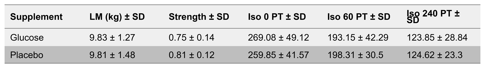
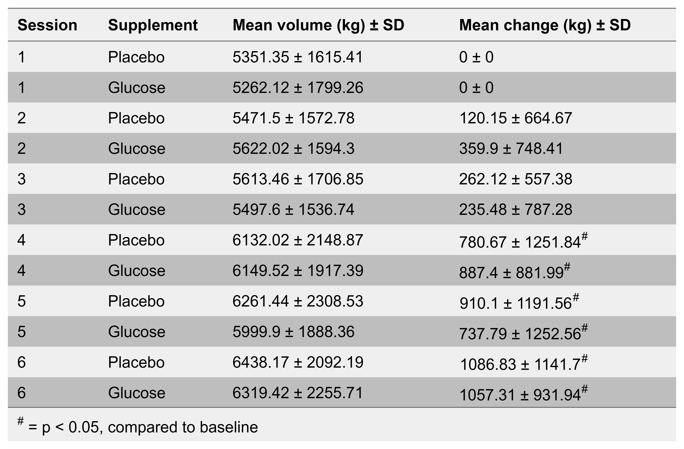

```{r setup, include=FALSE}
knitr::opts_chunk$set(echo = FALSE, message = FALSE, warning = FALSE)
```

```{r packages}
library(tidyverse);library(readxl);library(lme4);library(emmeans);library(dplyr);library(cowplot);library(knitr);library(broom);library(rmarkdown);library(tinytex);library(tidyr);library(arsenal);library(magrittr);library(dabestr);library(nlme); library(pbkrtest);library(ggpubr); library(lmer)
```


## Results

```{r glucose data + model}
## Scripts:
# - gluc.responsechange.R


# Data
glu.change <- readRDS("./data/data-gen/glucose/glu.change.RDS") # Untransformed data, used in figures
glu.logchange <- readRDS("./data/data-gen/glucose/glu.logchange.RDS") # Log-transformed data, used in the analysis

## Model
# Untransformed
glu.mod <- lmerTest::lmer(change ~ 0 + baseline + time + supplement:time + (1|subject),
                     data = glu.change)
glu.res <- plot(glu.mod)
glu.sum <- summary(glu.mod)

# Log-transformed
glu.lmod <- lmerTest::lmer(change ~ 0 + baseline + time + supplement:time + (1|subject),
                     data = glu.logchange)
glu.lres <- plot(glu.lmod)
glu.lsum <- summary(glu.lmod)

## Emmeans
# Untransformed
glu.emm <- confint(emmeans(glu.mod, specs = ~"supplement|time")) %>%
        data.frame()

# Log-transformed
glu.lemm <- confint(emmeans(glu.lmod, specs = ~"supplement|time")) %>%
        data.frame()

# For inline plotting
bcoef <- coef(summary(glu.lmod))
pscient.120 <- round(bcoef[8,5], 30)
p.120 <- sprintf("%.5f", 1.700971e-16)
pscient.135 <- round(bcoef[9,5], 30)
p.135 <- sprintf("%.5f", 4.299568e-11)
pscient.150 <- round(bcoef[10,5], 30)
p.150 <- sprintf("%.5f", 1.445712e-11)
p.270 <- round(bcoef[11,5], 2)
```

```{r c-peptide data + model}
## Scripts
# - insulin.change.R

## Data
cpep.change <- readRDS("./data/data-gen/glucose/cpep.change.RDS") # Untransformed data, for figures
cpep.lchange <- readRDS("./data/data-gen/glucose/cpep.logchange.RDS") # Log-transformed data, for analysis


## Linear mixed effects model
# Untransformed
cpep.mod <- lmerTest::lmer(change ~ 0 + baseline + time + supplement:time + (1|subject),
                     data = cpep.change) 
cpep.res <- plot(cpep.mod)
cpep.sum <- summary(cpep.mod)

# Log-transformed
cpep.lmod <- lmerTest::lmer(change ~ 0 + baseline + time + supplement:time + (1|subject),
                     data = cpep.lchange) 
cpep.lres <- plot(cpep.lmod)
cpep.lsum <- summary(cpep.lmod)

## Emmeans
# Untransformed
cpep.emm <- confint(emmeans(cpep.mod, specs = ~"supplement|time")) %>%
  data.frame()

# Log-transformed
cpep.lemm <- confint(emmeans(cpep.lmod, specs = ~"supplement|time")) %>%
  data.frame()

# For inline plotting
cpcoef <- coef(summary(cpep.lmod))
pscient.120 <- round(cpcoef[6,5], 30)
cpp.120 <- sprintf("%.5f", 3.229267e-15)
cpscient.150 <- round(cpcoef[7,5], 30)
cpp.150 <- sprintf("%.5f", 1.414491e-15)
cpp.270 <- round(cpcoef[8,5], 2)

```

```{r strength model}
## Scripts:
# - Strength.index.R

## Data
str.change <- readRDS("./data/data-gen/humac/str.change.RDS") # Untransfromed data
str.lchange <- readRDS("./data/data-gen/humac/str.lchange.RDS") # Log-transfromed data


## Linear mixed effects model

# Untransformed model
str.mod <- lmerTest::lmer(change ~ 0 + baseline + time + supplement:time + (1|subject),
                         data = str.change)
str.res <- plot(str.mod)
str.sum <- summary(str.mod)

# Log-transformed model
str.lmod <- lmerTest::lmer(change ~ 0 + baseline + time + supplement:time + (1|subject),
                        data = str.lchange)
str.lres <- plot(str.lmod)
str.lsum <- summary(str.lmod)

## Emmeans
# Untransformed
str.emm <- confint(emmeans(str.mod, specs = ~"supplement|time")) %>%
  data.frame() 

# Log-transformed
str.lemm <- confint(emmeans(str.lmod, specs = ~"supplement|time")) %>%
  data.frame() 

# For inline plotting
strcoef <- coef(summary(str.mod))
pdiff.c4 <- round(strcoef[10,5], 2)

```

```{r nutrition model}
# Scripts
# - nut.change.R

# Data
pro.change <- readRDS("./data/data-gen/nutrition/pro.change.RDS")
fat.change <- readRDS("./data/data-gen/nutrition/fat.change.RDS")
cho.change <- readRDS("./data/data-gen/nutrition/cho.change.RDS")
cal.change <- readRDS("./data/data-gen/nutrition/cal.change.RDS")
propr.change <- readRDS("./data/data-gen/nutrition/propr.change.RDS")

## Models
# Protein
pro.mod <- lmerTest::lmer(change ~ 0 + d1 + time + supplement:time + (1|subject),
                     data = pro.change)

pro.res <- plot(pro.mod)
pro.sum <- summary(pro.mod)


# Fat
fat.mod <- lmerTest::lmer(change ~ 0 + d1 + time + supplement:time + (1|subject),
                     data = fat.change)

fat.res <- plot(fat.mod)
fat.sum <- summary(fat.mod)


# Carbohydrates
cho.mod <- lmerTest::lmer(change ~ 0 + d1 + time + supplement:time + (1|subject),
                     data = cho.change)

cho.res <- plot(cho.mod)
cho.sum <- summary(cho.mod)


# Calories
cal.mod <- lmerTest::lmer(change ~ 0 + d1 + time + supplement:time + (1|subject),
                     data = cal.change)

cal.res <- plot(cal.mod)
cal.sum <- summary(cal.mod)


# Protein/kg
propr.mod <- lmerTest::lmer(change ~ 0 + d1 + time + supplement:time + (1|subject),
                     data = propr.change)

propr.res <- plot(propr.mod)
propr.sum <- summary(propr.mod)

## Emmeans

# Protein
protein.emm <- confint(emmeans(pro.mod, specs = ~"supplement|time")) %>%
  data.frame()

# Fat
fat.emm <- confint(emmeans(fat.mod, specs = ~"supplement|time")) %>%
  data.frame()

# Carbohydrates
cho.emm <- confint(emmeans(cho.mod, specs = ~"supplement|time")) %>%
  data.frame()

# Calories
cal.emm <- confint(emmeans(cal.mod, specs = ~"supplement|time")) %>%
  data.frame()

# Protein/kg
propr.emm <- confint(emmeans(propr.mod, specs = ~"supplement|time")) %>%
  data.frame()


```

At baseline, there were no significant differences between training with glucose or placebo in muscle mass, isometric or isokinetic peak torque (Tab 1) or total session volume (Tab 2). Further, on pairwise consecutive days, there were no significant differences in mean macro nutrient (calories, carbohydrate, fat or protein) intake. 

###### **Table 1:**  Baseline descriptives of legs allocated to RT with glucose or RT. LM = Lean mass, Strength = strength index, calculated from isometric and isokinetic peak torque, Iso 0 PT = Isometric (0 d/s) peak torque, Iso 60 PT = Isokinetic peak torque at 60 d/s, Iso 240 PT = Isokinetic peak torque at 240 d/s.

Glucose ingestion before and after RT led to significant increases in plasma levels of glucose and c-peptide before, during and after the session, compared to RT with placebo, (Fig 1B, 120min: 38 ± 4% [*p* = `r p.120`], 135min: 31 ± 4% [*p* = `r p.135`], 150min: 32 ± 4% [*p* = `r p.150`], Fig 1C, 120min: 95 ± 10% [*p* = `r cpp.120`], 150min: 87 ± 10% [*p* = `r cpp.150`]), measured during the sixth RT session. At 2hrs post-exercise, RT with glucose led to significantly lower plasma glucose levels compared to RT with placebo (1B, 270min: -8 ± 4% [*p* = `r p.270`]. 

######**Table 2:** Mean total session volume and mean change in total session volume from session 1 to session 6. 

There were no significant differences in change of skeletal muscle strength, at time points post 2 RT sessions, post 4 RT sessions, 30min after 6th session, 2hrs after 6th session and 23hrs after 6th session (Fig 1D, *p* > 0.05). After 5 RT sessions (Fig 1D, Post 5RT), there was a significant difference in strength between glucose and placebo,  where placebo decreased strength 7% more than glucose (*p* = `r pdiff.c4`).


###### **Figure 1:** A) An overview of the experimental design with 12 days of concomitant dietary intervention and resistance training (RT), preceded by 7 days involving familiarization. Between days -7 and -1, participants were familiarized to the RT exercises via 1RM leg press and knee extension testing, and to the strength tests via Humac Norm dynamometer (days -7 and -5). Before baseline testing, the participants were randomly allocated to exercise one leg with GLU (glucose) and the other with PLA (placebo), in a unilateral, alternating fashion. Further, non-dominant/dominant + GLU/PLA, and onset with GLU or PLA was also randomized, i.e. the figure illustrates an example where the participant was randomized to start RT with GLU. Biopsies were taken from m. vastus lateralis at baseline (Day 1 leg 1, Day 2 leg 2), and after five RT sessions (Day 11 leg 1, Day 12 leg 2). Blood for measurement of plasma glucose and -c-peptide was sampled at baseline (Day 1), and during post testing (Day 11 leg 1, Day 12 leg 2), via finger draws and venous blood samples. Skeletal muscle strength was measured as peak torque in unilateral isometric and isokinetic (at 60 and 240 d/s) knee extension before, multiple times during, and after five and six session. A total of three participants dropped out of the intervention, either due to reported muscular discomforts of heavy RT, or sickness in their family. B and C) Changes in plasma glucose (B, mmol/L) and c-peptide levels (C, pmol/L). Glucose levels in blood was measured via finger draws 120 (-120), 90 (-90), and 30min (-30) before RT, immediately before RT (0), during RT (15), immediately after RT (30) and 2hrs after RT (120). C-peptide levels were measured simultaneously to these finger draws, except for 90min before and during RT. D) Changes in muscular strength measured as isometric and isokinetic peak torque (60 and 240 d/s) via Humac Norm Dynamometer, conducted at baseline (A: Day -1), after two and four RT sessions (A: Day 4 and 8 leg 1, Day 5 and 9 leg 2), after five RT sessions/before the 6th session (Day 11 leg 1, Day 12 leg 2), as well as 30min, 2hrs and 23hrs after the 6th RT session (A: Day 11/12 leg 1, Day 12/13 leg 2). The index was calculated by normalizing peak torque values to the highest peak torque value at each respective speed, and then summarized and used in change score calculations. Values are presented as changes in estimated marginal means ± 95% CI. * = *p* < 0.05 between groups. Glucose n = 13, placebo n = 13.

### Markers of ribosome biogenesis

#### Total RNA and ribosomal RNA

```{r total RNA model}
## Scripts
# - totrna.cleanup.R
# - totrna.analysis.R


# Data
trna.lchange <- readRDS("./data/data-gen/rna/totrna.change.RDS")

# Create model: 
trna.lmod <- lmerTest::lmer(change ~ pre + supplement + (1|subject), 
           data = trna.lchange)
    
trna.lres <- plot(trna.lmod)
trna.lsum <- summary(trna.lmod)

### Get estimated means from the model
trna.emm <- confint(emmeans(trna.lmod, specs = ~"supplement")) %>%
    data.frame()

# For inline reporting
trcoef <- coef(summary(trna.lmod))
trdiff <- round(trcoef[3,1], 2)
trdiffp <- round(trcoef[3,5], 2)
trdiffse <- round(trcoef[3,2], 2)

```

```{r rRNA data model}
## Scripts
# - qpcr-import
# - qpcr-analysis
# - rrna.change
# - rrnachange.figs

# Log-transformed data
lchange.18 <- readRDS("./data/data-gen/rna/lchange.18.RDS")
lchange.28 <- readRDS("./data/data-gen/rna/lchange.28.RDS")
lchange.58 <- readRDS("./data/data-gen/rna/lchange.58.RDS")
lchange.5 <- readRDS("./data/data-gen/rna/lchange.5.RDS")
lchange.47 <- readRDS("./data/data-gen/rna/lchange.47.RDS")

# Create model: 
# Needs to have an intercept per participant (mixed model)
# Control for pre values.

# 18S
lmod.18 <- lmerTest::lmer(change ~ pre + supplement + (1|subject), 
                     data = lchange.18)
lres.18 <- plot(lmod.18)
lsum.18 <- summary(lmod.18)

# 28S
lmod.28 <- lmerTest::lmer(change ~ pre + supplement + (1|subject), 
                     data = lchange.28)
lres.28 <- plot(lmod.28)
lsum.28 <- summary(lmod.28)

# 5.8S
lmod.58 <- lmerTest::lmer(change ~ pre + supplement + (1|subject), 
                     data = lchange.58)
lres.58 <- plot(lmod.58)
lsum.58 <- summary(lmod.58)

# 5S
lmod.5 <- lmerTest::lmer(change ~ pre + supplement + (1|subject), 
                     data = lchange.5)
lres.5 <- plot(lmod.5)
lsum.5 <- summary(lmod.5)

# 47S
lmod.47 <- lmerTest::lmer(change ~ pre + supplement + (1|subject), 
                     data = lchange.47)
lres.47 <- plot(lmod.47)
lsum.47 <- summary(lmod.47)

### Get estimated means from the model, these are average increase at 
# pre = 0 (the average pre value)
# remember that these are originally log-fold change values, transformed back using exp(emmean) etc

# 18S
lemm.18 <- confint(emmeans(lmod.18, specs = ~"supplement")) %>%
        data.frame()

# 28S
lemm.28 <- confint(emmeans(lmod.28, specs = ~"supplement")) %>%
        data.frame()

# 5.8S
lemm.58 <- confint(emmeans(lmod.58, specs = ~"supplement")) %>%
        data.frame()

# 5S
lemm.5 <- confint(emmeans(lmod.5, specs = ~"supplement")) %>%
        data.frame()

# 47S
lemm.47 <- confint(emmeans(lmod.47, specs = ~"supplement")) %>%
        data.frame()

## For inline reporting

# 18S
rr18coef <- coef(summary(lmod.18))
rr18diffp <- round(rr18coef[3,5], 3)
rr18diffse <- round(rr18coef[3,2], 3)

# 28S
rr28coef <- coef(summary(lmod.28))
rr28diffp <- round(rr28coef[3,5], 3)
rr28diffse <- round(rr28coef[3,2], 3)

# 5.8S
rr58coef <- coef(summary(lmod.58))
rr58diffp <- round(rr58coef[3,5], 3)
rr58diffse <- round(rr58coef[3,2], 3)

# 5S
rr5coef <- coef(summary(lmod.5))
rr5diffp <- round(rr5coef[3,5], 3)
rr5diffse <- round(rr5coef[3,2], 3)

# 47S
rr47coef <- coef(summary(lmod.47))
rr47diffp <- round(rr47coef[3,5], 3)
rr47tdiffp <- round(rr47coef[1,5], 3)
rr47diffse <- round(rr47coef[3,2], 3)

```

Resistance training with glucose did not induce a higher accumulation of total RNA (fig 2A, *p* = `r trdiffp`) or rRNA  (fig 2B, 47S: *p* = `r rr47diffp`, 18S: *p* = `r rr18diffp`, 28S: *p* = `r rr28diffp`, 5.8S: *p* = `r rr58diffp`, 5S: *p* = `r rr5diffp`) compared to RT with placebo, measured as mean change from baseline to post. From baseline to post-intervention, there was a mean increase in levels of total RNA by 26 and 22% after RT with glucose and placebo, respectively (*p* < 0.05, compared to baseline). A robust accumulation was also observed in ribosomal RNA expression in both RT with glucose and placebo, with mean increases between 34-43% (GLU) and 33-41% (PLAC) (*p* < 0.05, compared to baseline) in the four rRNA’s. The expression of the 47S pre-rRNA increased by 37 and 59% with glucose and placebo respectively, where only RT with placebo increased significantly from baseline to post (fig 45, *p* = `r rr47tdiffp`).

###### **Figure 2:** Changes in total RNA and ribosomal RNA. A) Total RNA, B) 47S pre-rRNA, 18S rRNA, 28S rRNA, 5.8S rRNA, 5S rRNA. Baseline = Day 1 leg 1/ Day 2 leg 2, Post = Day 11 leg 1, Day 12 leg 2. Total RNA and rRNA were analyzed in duplicates, with two duplicates per biopsy (two muscle tissue pieces per time point), and normalized to ng x mg wet muscle weight for total RNA and external reference gene (Lambda) for rRNA. Total RNA and rRNA changes were calculated as log-fold change score per mg wet muscle weight. Mean change scores of the duplicates were calculated and transformed to the log-scale before modelling, then reverse-transformed for figure illustration. Values are estimated marginal means fold change per leg per supplement ± 95% CI. Glucose n = 13, placebo n = 13.

#### Protein

```{r western modelling}
## Script: 
# - western.import.R
# - western.cleanup.R
# - western.analysis.R

# Data
prot.dat <- readRDS("./data/data-gen/protein/prot.datc.RDS") # from the script: western.cleanup.R


### Modelling target signal per supplement 
# These models try to explain the normalised signal by time, supplement and time+supplement (?). The random = list command creates an individual 
# intercept for the included (e.g., subject, gel.sample). 

## c-Myc model

# Untransformed
cmyc.mod <- lme(norm.sign ~ time + supplement + time:supplement, 
                random = list(subject = ~ 1),
                data = filter(prot.dat, target == "cmyc"))

cmyc.sum <- summary(cmyc.mod)
cmyc.res <- plot(cmyc.mod, resid(., type = "p") ~ fitted(.))


# Log-transformed
cmyc.lmod <- lme(log(norm.sign) ~ time + supplement + time:supplement, 
                 random = list(subject = ~ 1),
                 data = filter(prot.dat, target == "cmyc"))

cmyc.lsum <- summary(cmyc.lmod)
cmyc.lres <- plot(cmyc.lmod, resid(., type = "p") ~ fitted(.))


## UBF model
# Untransformed
ubf.mod <- lme(norm.sign ~ time + supplement + time:supplement, 
               random = list(subject = ~ 1),
               data = filter(prot.dat, target == "ubf"))


ubf.sum <- summary(ubf.mod)
ubf.res <- plot(ubf.mod, resid(., type = "p") ~ fitted(.))

# Log-transformed
ubf.lmod <- lme(log(norm.sign) ~ time + supplement + time:supplement, 
                random = list(subject = ~ 1),
                data = filter(prot.dat, target == "ubf"))


ubf.lsum <- summary(ubf.lmod)
ubf.lres <- plot(ubf.lmod, resid(., type = "p") ~ fitted(.))


# RPS6 model
# Untransformed
rps6.mod <- lme(norm.sign ~ time + supplement + time:supplement, 
                 random = list(subject = ~ 1),
                 data = filter(prot.dat, target == "rps6"))

rps6.sum <- summary(rps6.mod)
rps6.res <- plot(rps6.mod, resid(., type = "p") ~ fitted(.))


# Log-transformed
rps6.lmod <- lme(log(norm.sign) ~ time + supplement + time:supplement, 
          random = list(subject = ~ 1),
          data = filter(prot.dat, target == "rps6"))

rps6.lsum <- summary(rps6.lmod)
rps6.lres <- plot(rps6.lmod, resid(., type = "p") ~ fitted(.))


### Getting emmeans from the models

## c-Myc emmeans
# Untransformed
cmyc.emm <- emmeans(cmyc.mod, specs = ~ time|supplement) %>%
  data.frame()

# Log-transformed
cmyc.lemm <- emmeans(cmyc.lmod, specs = ~ time|supplement) %>%
  data.frame()


## UBF emmeans
# Untransformed
ubf.emm <- emmeans(ubf.mod, specs = ~ time|supplement) %>%
  data.frame()

# Log-transformed
ubf.lemm <- emmeans(ubf.lmod, specs = ~ time|supplement) %>%
  data.frame()


## RPS6
# Untransformed
rps6.emm <- emmeans(rps6.mod, specs = ~ time|supplement) %>%
  data.frame()

# Log-transformed
rps6.lemm <- emmeans(rps6.lmod, specs = ~ time|supplement) %>%
  data.frame()


### For inline reporting
## Diff cmyc

ccoef <- coef(summary(cmyc.lmod))
cdiff <- round(ccoef[4,5], 3)
cpla <- round(ccoef[2,5], 20)

## Diff UBF
ucoef <- coef(summary(ubf.lmod))
udiff <- round(ucoef[4,5], 3)

## Diff rps6
rpcoef <- coef(summary(rps6.lmod))
rpdiff <- round(rpcoef[4,5], 3)

```

```{r correlation model}
# Data 
west.dat <- readRDS("./data/data-gen/protein/prot.datc.RDS") # Quantified and cleaned western data,
                                                               # (outliers marked) normalised by pool

rna.dat <- readRDS("./data/data-gen/rna/rna.dat.RDS") # Quantified and cleaned (outliers marked), 
                                                      # total RNA data, normalised by wet muscle weight


## Prepare data frames for joining

ubf.rdy <- west.dat %>%  # One data frame without outliers
  select(subject, time, outlier, supplement, target, norm.sign) %>%
  filter(target == "ubf",
         outlier == "in") %>%
  select(-target) %>%
  group_by(subject, time, supplement) %>%
  summarise(mean.sign = mean(norm.sign, na.rm = TRUE)) %>%
  print()


rna.rdy <- rna.dat %>%
  select(subject, time, outlier, supplement, RNA.weight) %>%
  filter(outlier == "in") %>%
  mutate(subject = as.character(subject)) %>%
  group_by(subject, time, supplement) %>%
  summarise(mean.rna = mean(RNA.weight, na.rm = TRUE)) %>%
  print()

## Correlation analysis

joined.dat <- ubf.rdy %>%
  right_join(rna.rdy) %>%
  #filter(supplement != "GLUCOSE") %>%
  
  mutate(sd.ubf = (mean.sign - mean(mean.sign, na.rm = TRUE )/sd(mean.sign, na.rm = TRUE))) %>%
  print()


library(nlme)

corr.mod <- lme(mean.rna ~ mean.sign + time , 
         random = list(subject = ~ 1), 
          data = joined.dat, 
         na.action = na.omit)

corr.sum <- summary(corr.mod)
corr.res <- plot(corr.mod)

corr.lmod <- lme(log(mean.rna) ~ log(mean.sign) + time , 
         random = list(subject = ~ 1), 
          data = joined.dat, 
         na.action = na.omit)

corr.lsum <- summary(corr.lmod)
corr.lres <- plot(corr.lmod)

corrcoef <- coef(summary(corr.mod))
corrp <- round(corrcoef[2,5], 3)
```

Levels of c-Myc increased 51% more after RT with placebo compared to RT with glucose, a significant difference (Fig 3A: *p* = `r cdiff`). Levels of UBF and rpS6 increased 42 and 33% more in placebo compared to glucose, however, this was not a significant difference (Fig 3A: UBF: *p* = `r udiff`, rpS6: *p* = `r rpdiff`). The increase in both RT with glucose and placebo for all measured proteins was significant at post compared to baseline (*p* < 0.05). Further, there was a linear relationship between UBF and total RNA, where an increase of 1 SD unit of UBF equated to a 13% increase in total RNA (*p* = `r corrp`).

###### **Figure 3:** Changes in levels of protein. A) Mean UBF, c-Myc and rpS6 (AU, arbitrary units) at baseline and post + representative western blots of the respective proteins. Baseline = Day 1 leg 1, Day 2 leg 2, post = Day 11 leg 1, Day 12 leg 2. GLU = glucose, PLA = placebo. Protein samples were analyzed in two duplicates per biopsy per time point, loaded on separate gels in an inverted order, e.g. from gel 3 to 6, as shown by the duplicates (1 and 2). Change in protein levels were calculated as log-fold change scores normalized by pools (pool of all protein samples per gel). Mean log-change scores of the duplicates were calculated before modelling and reverse-transformed for figure illustration. Values are estimated marginal means fold change per leg per supplement ± 95% CI. * = *p* < 0.05 between groups. Glucose n = 13, placebo n = 13. B) Representative total protein stain blot. C) Linear relationship between total RNA (ng x mg) and UBF levels (SD units), with time added as a covariate. Total RNA was normalized by wet muscle weight, and UBF was normalized by pools per gel, and total protein per lane factor. Values are presented as log-transformed means.


