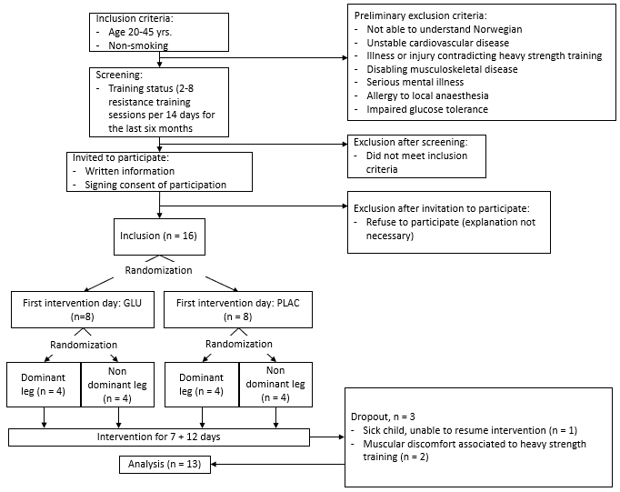
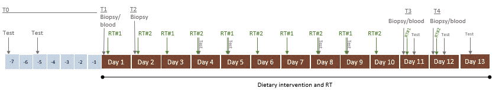
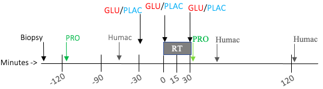

```{r setup, include=FALSE}
knitr::opts_chunk$set(echo = FALSE, message = FALSE, warning = FALSE)
```

```{r packages}
library(tidyverse);library(readxl);library(lme4);library(emmeans);library(dplyr);library(cowplot);library(knitr);library(broom);library(rmarkdown);library(tinytex);library(tidyr);library(arsenal);library(magrittr);library(dabestr);library(nlme); library(pbkrtest)
```


## Introduction

Regular resistance exercise training (RT) increases muscle mass and muscle strength, due to the adaptations stimulated by  mechanical strain. Unfortunately, responses to RT are not uniform across the population. Studies have shown RT-induced muscle growth to vary widely between individuals, with as much as 10-15% showing considerably impaired growth (ALVAREZ18;MANN14;THALACKER13). This may be explained by genetics, epigenetics, and/or an unfavourable internal physiological milieu (FIGUEIREDO21;HAMMARSTROM20;THALACKER13). While tweaking training modalties and -protocols induces different responses in different populations (HAMMARSTROM20), little is known regarding optimisation of RT to individual phenotypes. Generally, meta-analyses favour a moderate volume of RT over low volume RT regarding muscle growth (KRIEGER09;RHEA03;SCHOENFELD17), substantiated by recent RCTs (HAMMARSTROM20;SCHOENFELD19). Although Hammarström and colleagues (2020) found that a moderate volume led to more prominent gains in muscle mass, approximately 50% of the participants did not experience true benefits of moderate volume compared to low, with a blunted muscle growth. Due to the variations observed in muscle growth responses despite standardising RT protocols (HAMMARSTROM20;SCHOENFELD17;STEC16), it is apparent that increasing RT volume alone does not convert low-responders to high-responders. Therefore, other means than RT *per se* seems necessary to circumvent this discrepancy.

Indeed, ingesting nutrients such as protein- and creatine-supplements effectively optimise RT (CERMAK12;LANHERS15;LANHERS17). However, it remains unknown if other nutritional adjuvants such as glucose can increase the efficacy of RT. This is surprising, as glucose is the preferred energy substrate of the contracting skeletal muscle during strenuous exercise and a major supplier of energy to cells via ATP synthesis (MUL15;TANAKA18). Energy availability is important to regulate central processes of muscle growth, specifically ribosome biogenesis, a key factor for increased muscle protein synthesis (MPS) (FIGUEIREDO19;HAMMARSTROM20;VONWALDEN19;TANAKA18). Interestingly, variations in RT-induced responses have been linked to ribosome biogenesis, where participants responding poorly to RT also showed a blunted ribosome biogenesis (HAMMARSTROM20;STEC16). A blunted ribosome biogenesis negates responses to RT by failure to produce novel ribosomes, thus an inability to increase the skeletal muscle cell’s translational capacity (VONWALDEN19;FIGUEIREDO19). Therefore, investigating the effects of combined RT and glucose ingestion may provide valuable insight into the regulation of ribosome biogenesis.

Ribosome biogenesis is suggested to be regulated by the mammalian target of rapamycin complex 1 (mTORC1) network (KUSNADI15;VONWALDEn19;TANAKA18). Stimulated by growth factors, hormones, mechanical loading and nutrients, mTORC1 governs energy distribution by turning on/off energy-consuming and energy-generating pathways, depending on cellular energy levels (HOPPE09). This greatly affects ribosome biogenesis, being a process that consumes approximately 80% of cellular energy and materials (VONWALDEN19;TANAKA18). Upon stimulation by mTORC1, assembly of the preinitiation complex (PIC) marks the initiation of ribosome biogenesis (VONWALDEN19;FIGUEIREDO19). The PIC consists of the RNA polymerase I complex, the SL-1 complex and the TIF-1A/RRN3 protein (FIGUEIREDO19, VONWALDEN19). Further, the upstream binding factor (UBF) and c-Myc have vital roles in the initiation, where UBF binds the PIC to the rDNA promoter and c-Myc as a transcription factor (FIGUEIREDO19, VONWALDEN19). Pol I transcribes the 47S pre-rRNA, suggested as the rate-limiting step in ribosome biogenesis (VONWALDEN19, FIGUEIREDO19). The 47S pre-rRNA is processed into the 18S, 5.8S and 28S rRNA (MULLINEUX12, VONWALDEN19), while the last rRNA 5S is transcribed by Pol III, and the ribosomal proteins by Pol II (MULLINEUX12, VONWALDEN19). Importantly, these events facilitates increased ribosomal content of each skeletal muscle cell, subsequently allowing a higher basal- and roof for MPS, suggested to predict long term adaptations to RT (HAMMARSTROM21). Since a blunted ribosome biogenesis has been observed to reduce/inhibit RT responses, despite increasing mechanical loading (HAMMARSTROM20), targeting hormonal and/or nutritional signals may ameliorate this. Previously, high glucose treatment promoted ribosome biogenesis compared to a repressed ribosome biogenesis with low glucose treatment and glucose starvation in mice and cell cultures (MARIAPPAN11;TANAKA15;ZHAI12), making glucose an interesting player in this perspective. 

Thus, though it seems apparent that sufficient daily intake of glucose/carbohydrates is necessary for an optimal ribosome biogenesis (TANAKA18), it is unclear whether there are acute effects on ribosome biogenesis *per se* with ingesting glucose before and after RT. Further, there are equivocal observations on insulin's impact on ribosome biogenesis and MP, where previous meta-analyses suggest insulin to act in concert with amino acid intake to enhance MPS, and insulin may reduce skeletal muscle protein breakdown when amino acids are scarce (ABDULLA16). Therefore, to investigate the relationship between glucose, RT and ribosome biogenesis we recruited 16 healthy young, moderately trained male and female individuals to moderate volume unilateral resistance training for two weeks. They exercised one leg with glucose and protein, and the other leg with placebo and protein ingestion before and after each RT-session. Our main purpose was to investigate whether there are acute effects of glucose- compared to placebo ingestion before and after RT. To assess this purpose, we measured changes in ribosome biogenesis as accumulation of total RNA, expression of the four mature rRNA's (18S, 5.8S, 28S, 5S), 47S pre-rRNA, and levels of proteins associated with transcription initiation (c-Myc, UBF, rpS6?). As secondary outcomes, we measured the development in skeletal muscle performance during the intervention, and skeletal muscle recovery after the final RT session, as temporal changes in maximal isometric and isokinetic torque. We hypothesised that RT would indeed lead to a prominent accumulation of total RNA, increased expression of rRNA and associated proteins. Further, we hypothesised that RT with glucose and protein would induce an enhanced response compared to placebo, in markers of ribosome biogenesis, as well as muscular performance and -recovery.


## Methods

### Materials and methods

All participants were informed about the potential discomforts and risks associated with the study and gave their informed consent before study enrollment. The study was approved by the regional ethical committee (REK, ID nr. 153628), pre-registered at clinicaltrials.gov (Identifier: NCT04545190), and conducted according to the Helsinki declaration.

### Participants

Sixteen healthy male and female participants (20-33yrs, Tab 1) were recruited to the study through social media advertisement and word of mouth, and through completing the selection process (Fig 1). The eligibility criteria were non-smokers and moderately trained (i.e. 2-8 RT sessions per 14 days for the last six months). Exclusion criteria were previous injury leading to impaired strength, inability to perform resistance training, symptoms and a medical record of metabolic disorders including hyperglycemia, i.e. fasting venous plasma glucose ≥6.1 mmol/L and/or 2-hour glucose tolerance ≥7.8 mmol/L, and/or HbA1c >42 mmol/mol. Of the sixteen participants that commenced the intervention, three participants dropped out. One due to sickness and inability to resume, two participants experienced muscular discomfort connected to heavy resistance training (Fig 1). Baseline characteristics (Tab 1) were measured using DXA (Prodigy Advance PA+302047, Lunar, San Francisco, CA, USA) on Day -1, the last day preceding the RT intervention.

### Experimental design

The study was designed as a 12-day double-blinded randomized controlled trial, with a unilateral RT protocol (Fig 2). Participants were randomized to commence with either glucose (GLU, 30g per bolus) or placebo (PLAC, 0g per bolus), and either dominant or non-dominant leg (Fig 1), alternating RT and supplement from one day to the other (Fig 2). Investigators were blinded as the supplement randomization was disclosed only to personnel not involved in any other aspect of the study, and participants were blinded by diluting boluses of glucose (30g glucose) (Glucosum monohydricum, Merck KGaA, Darmstadt, Germany) and placebo (~0.3g Stevia rebaudiana extract) (Steviosa, Soma Nordic AS, Oslo, Norway) in 300ml Fun Light juice/saft (Orkla, Oslo, Norway). A blinded taste test revealed that the participants were not able to disclose the contents of the provided boluses (30g GLU vs. 0g GLU). To ensure equal conditions during training sessions, participants exercised and tested at the same time of day, +/- 1hr with the same trainer, and recorded and repeated their daily macro nutrient intake on pairwise consecutive days (Tab 4).

###### **Table 1:** Baseline characteristics of the participants. BMI: body mass index, A = charactaristics per sex, B = characteristics per leg. Values are mean ± standard deviation.

```{r DXA}
# Script: DXA

# Data handling
table.dxa <- read_excel("./data/dxa/ribose_dxa.xlsx") %>%
        select(sex, subject, age, height, weight, leanmasskg, fatmasskg, ffmg) %>%
        #make grams into kg
        mutate(ffkg = ffmg/1000) %>%
        select(sex, age, height, weight, leanmasskg, fatmasskg, ffkg) %>%
  mutate(bmi = (weight) / (height^2) * 10000)

dxa.table <- table.dxa %>%
        pivot_longer(names_to = "variable",
                     values_to = "values", col= age:bmi) %>%
        select(sex, variable, values) %>%
        group_by(sex, variable) %>%
        summarise(m = mean(values, na.rm = TRUE),
                  s= sd(values, na.rm = TRUE)) %>%
        mutate(stat = paste0(round(m, 1), " (", round(s, 1), ")")) %>%
        select(sex, variable, stat) %>%
        pivot_wider(names_from = sex,
                    values_from = stat) %>%
                mutate(variable = if_else(variable %in% c("age"),
                                          "Age (yrs)",
                                          if_else(variable %in% c("fatmasskg"),
                                                  "Fat mass (kg)",
                                                  if_else(variable %in% c("ffkg"),
                                                          "Fat free mass (kg)",
                                                          if_else(variable %in% c("height"),
                                                                  "Height (cm)",
                                                                  if_else(variable %in% c("leanmasskg"),
                                                                          "Lean body mass (kg)",
                                                                          if_else(variable %in% c("weight"),
                                                                                  "Body weight (kg)",
                                                                                  if_else(variable %in% c("bmi"),
                                                                                          "BMI", "")
                                                                                  )))))))


dxa.table %>%
        kable(col.names = c("Variable", "Female (n=7)", "Male (n=9)"))

```

```{r dxa per leg}
# Script: DXA

# Subject 104, 110 and 111 dropped out and is therefore excluded from the table

#Load dxa data
dxaleg <-  read_excel("./data/dxa/ribose_dxaprleg.xlsx") %>%
        select(subject, sex, leg, leanmassg, fatmassg, totalmasskg) %>%
        #make grams into kg
        mutate(leanmass = leanmassg/1000,
               fatmass = fatmassg/1000)%>%
        select(subject, sex, leg, leanmass, fatmass, totalmasskg) 

# Between groups analysis 
dxa.stat <- dxaleg %>%
        select(subject, leg, leanmass, fatmass, totalmasskg) 

# Lean mass between legs, within subject 
leanmass.lm <- lmer(leanmass ~ leg + leg:subject + (1|subject), data = dxa.stat)
lm.plot <- plot(leanmass.lm)
lm.sum <- summary(leanmass.lm)
lm.confint <- emmeans(leanmass.lm, specs = ~ "leg")

# Fat mass between legs, within subject
fat.lm <- lmer(fatmass ~ leg + leg:subject +(1|subject), data = dxa.stat)
fat.plot <- plot(fat.lm)
fat.sum <- summary(fat.lm)
fat.confint <- emmeans(fat.lm, specs = ~ "leg")

# Total mass between legs, within subject
total.lm <- lmer(totalmasskg ~leg + leg:subject + (1|subject), data = dxa.stat)
totlm.plot <- plot(total.lm)
totlm.sum <- summary(total.lm)
supsup <- emmeans(total.lm, specs = ~ "leg") 

# Table of leanmass, fatmass and total mass in kg pr. leg
dxalegtable <- dxaleg %>%
        select(leg, leanmass, fatmass, totalmasskg) %>%
        pivot_longer(names_to = "variable",
                     values_to = "values", col= leanmass:totalmasskg) %>%
        group_by(leg, variable) %>%
        summarise(m = mean(values, na.rm = TRUE),
                  s= sd(values, na.rm = TRUE)) %>%
        mutate(stat = paste0(round(m, 1), " (", round(s, 1), ")")) %>%
        select(leg, variable, stat) %>%
        pivot_wider(names_from = leg,
                    values_from = stat) 

# Markdown table
dxalegtable %>%
        kable(col.names = c("Variable", "Left leg", "Right leg"))

```

Six RT sessions were conducted with glucose and six with placebo, allowing a within-subjects analysis of the effects of glucose ingestion. Data from the first five RT sessions was used to investigate main outcome measures (total RNA, rRNA and protein), whereas data from the sixth RT session was used to explore secondary outcomes (muscular recovery, plasma glucose levels). Participants were asked to refrain from resistance- or high-intensity training of the legs from Day -7 and onwards, until completion of the intervention and post-testing, to ensure the reliability of pre-intervention strength data and minimal interference from other training sources. If participants did conduct exercise training outside of the prescribed protocol, they were asked to ensure equal loading on pairwise consecutive days.



###### **Figure 1:** Flowchart of the selection process. The order in which participants performed the two intervention blocks was determined in a planned randomised fashion. 



###### **Figure 2.** Overview of the intervention, with 12 days of concomitant dietary intervention and resistance training (RT), preceded by 7 days of testing. T0 = timepoint 0 (testing days prior to intervention), T1/T2 = biopsy prior to resistance training for leg #1 and #2, respectively, T3/T4 post intervention testing of leg #1 and #2, respectively, including post sixth RT session. Test = physical performance test (unilateral 1RM leg press, knee extension, isometric knee extension force, isokinetic knee extension torque) testing on days 4, 5, 8, 9, T3, T4 will not include 1RM leg press and knee extension, Biopsy = microbiopsy, RT#1 = resistance training leg #1, RT#2 = resistance training leg#2. Other tests (D2O, DXA, spit) will be conducted as part of the study as a whole. These are not relevant to this data set, thus will not be described here.

### Dietary intervention

The dietary intervention spanned the whole day, divided into three periods: I) From awakening until two hours after RT, II) from 2.5 hours after RT until 2200hrs, and III) from 2200hrs until awakening. During period I, participants ingested protein and glucose/placebo only. Glucose/placebo was ingested at three time points in period I: 30 minutes before RT (0830hrs, 30g vs 0g glucose), immediately before RT (0900hrs, 30g vs. 0g glucose), and immediately after RT (~0930hrs, 30g vs. 0g glucose). Protein was ingested 2hrs before RT (0700hrs, 25g) and immediately after RT (~0930hrs, 25g). In the afternoon (1800hrs-1900hrs, period II) participants ingested glucose or placebo (3x30g vs. 3x0g glucose) opposite to the supplement they received during RT, to ensure a balanced daily intake of glucose. Apart from this, participants ingested a self-chosen diet during period II, registered in MyFitnessPal or similar applications. The self-chosen diet was repeated on pairwise consecutive days (i.e. on days 1-2, 3-4, etc.), to ensure similar premises for resistance training responses between the two legs. During period III (2200-0700hrs), participants remained in an overnight fasted state. The daily onset of the dietary intervention (i.e., first ingestion of PRO supplement) varied between participants, from 0600hrs to 0900hrs to allow multiple participants to complete the protocol simultaneously. The protein supplement was ingested as 25g Whey Protein Isolate boluses (Proteinfabrikken, Stokke, Norway), diluted in 150ml water. During sessions, participants were free to ingest water ad libitum.

### Assessment of muscular strength

Performance tests (Test, Fig 2) were performed prior to (Days -7 and -5, and T0, both legs) and during the intervention (Days 4, 5, 8, and 9), after session 5 and after finalization of the intervention (T3/T4, RT#1 leg; T4/Day 13, RT#2 leg), a total of 10 days (Fig 2). Maximal isometric and isokinetic knee extension torque were measured with a Humac Norm Dynamometer (CSMi, Stoughton, Massechusetts, USA). Individual positions were recorded and standardized from pre-intervention tests (days -7 and -5). Maximal isokinetic torque was measured at speeds of 60- and 240 d/s, 2x3 repetitions each, with the first set of each exercise as a sub-maximal warm-up. The maximal isometric torque was measured at knee-angle 60, for a maximum of 10 seconds and two repetition per test. The highest peak torque values were carried forwards to the final analyses. During days 4, 5, 8 and 9, humac tests were conducted one hour before RT with the leg performing RT the previous day. During days 11 and 12 (T3 and T4), humac tests were performed at four time points: I) 45min before RT, II) 30min after the last RT session, III) 2hrs after the last RT session, and IV) 23hrs after the last RT session. Test I at T4 included testing of both legs, representing 23hrs post RT session test of one leg and pre-session 6 test of the other leg.

Assessment of unilateral one repetition maximum (1RM) leg press and knee extension was conducted at pre-intervention testing (days -7 and -5, Fig 2). The participants performed a general warm-up with 10min cycling on an indoor exercise bicycle and a specific warm-up (1x10, 1x6 and 1x3 repetitions, 2min breaks) before each of the tests. Between specific warm-up sets as well as between each subsequent 1RM attempt, the participants were given 3min breaks. All positions were controlled and recorded at pre-intervention testing and repeated for the RT sessions. Maximal leg press strength was defined as the maximal load lifted in a controlled fashion, with a knee angle of 45 degrees (start), within a 2.5kg range. Attempts, where participants did not reach 45 degrees during the eccentric phase, were not approved. Maximal knee extension testing followed the same specific warm-up and pause protocol and was defined as maximal load lifted in a controlled fashion, reaching full extension of the knee joint, within a 1.25kg range. Attempts with exaggerated hip movement or beneath full extension were not approved.


### Resistance training protocol

Resistance training consisted of three sets of each unilateral leg presses and knee extensions, with an intensity of 10 repetition maximum (10RM). As a general warm-up, the participants cycled on an indoor exercise bicycle for 5-10min. In addition, before the respective exercises, two 10-repetition warm-up sets were completed at ~50% and ~70% of 10RM. Rest time between working sets was 2min, and progressive loading was used to ensure adequate exercise stimulation throughout the intervention. For safety and standardization purposes, all sessions were monitored by trained personnel. To further ensure equal exercise premises for the two legs, each participant was accompanied by the same trainer in each session. If this was not possible throughout the intervention, each participant had the same trainer on pairwise consecutive days as a minimum. The rate of perceived exertion (RPE, 0–10-point scale) was logged before every session, and the session score was logged 15min after each session. Lastly, training volume (i.e., load and repetitions) was logged for every session.

### Sampling of muscle tissue and blood

Muscle biopsies were sampled from m. vastus lateralis using well-established procedures (HAMMARSTRØM20). Muscle biopsy sampling was performed under local anaesthesia (Xylocaine, 10mg ml-1 with adrenaline 5μg ml−1, AstraZeneca AS, Oslo, Norway) using a 12-14-gauge needle (Universal Plus, Mermaid Medical AS, Stenløse, Denmark), operated with a spring-loaded biopsy gun. After the biopsy sampling, muscle tissue was divided in two aliquots for determination of total RNA/expression of rRNA and two aliquots for protein analyses, snap frozen in isopentane (-80°C) and stored at -80°C until further analyses. Muscle biopsies were sampled at four time points (Fig 2): I/II) Pre-intervention (2hrs before training, time point T1 = pre RT#1 leg, T2 = pre RT#2 leg), and III/IV) before the sixth RT session from RT#1 leg (2hrs before training, T3) and before the sixth RT session from RT#2 leg (2hrs before training, T4). At each time point, two samples were taken from the same incision. To standardize this procedure, all individual participants had biopsies taken at the same time of day, in an overnight fasted state.

To measure blood glucose levels with and without glucose ingestion/training, blood was collected by means of finger draws on days with biopsy sampling. One finger draw was taken at T1 (pre-test, Fig 2) to serve as a baseline. At T3 and T4 (post-test, Fig 2), finger draws were collected at 7 time points: I) prior to protein ingestion (0700hrs) II) 45 minutes after protein ingestion (0745hrs) III) 1.5hrs after protein ingestion (0800hrs, i.e., immediately before GLU/PLAC intake), IIII) 2hrs after protein ingestion (0900hrs, i.e., immediately before training), IV) in the middle of RT (~0915hrs), V) immediately after training (~0930hrs), and VI) 2hrs after completion of training (~1130hrs). Finger draws were analysed with in-house equipment (BIOSEN C-Line, EKF diagnostic GmbH, Barleben). Venous blood samples were collected from the antecubital vein, coinciding with the finger draws except in the middle of the RT session, to analyse endocrine variables.

### Total RNA extraction and quantitative real-time reverse transcription polymerase chain reaction

Two muscle biopsy samples were taken for total RNA extraction per leg per time point, and total RNA was extracted in two duplicates per muscle biopsy. Thus, we had two duplicates per leg per time point, giving a total of eight RNA samples per participant. Total RNA was extracted using TRIzol according to the manufacturer’s protocol. An exogenous RNA control (λ polyA External Standard Kit, Takara Bio Inc., Shiga, Japan) was added at a fixed amount (0.04 ng ml-1 of Trizol reagent) to enable analysis of target gene expression per unit tissue weight (ELLEFSEN2008,2014). Briefly, muscle tissue was homogenized in TRIzol using 0.5mm RNase-free Zirconium beads (~50 ul) (Next Advanced, Averill Park, NY, USA) and a bullet blender (bb). Chloroform (Sigma-Aldrich, Missouri, USA) was used for phase-separation, and an RNA pellet was precipitated with isopropanol (VWR International, Pennsylvania, USA). For assessment of RNA content and -purity 5µl RNA, from the RNA stock, was eluted in TE-buffer (1:2), for assessment via spectrophotometry. All samples had a 260nm to 280nm ratio > 1.9. The RNA stock was stored at -80°C until further analyses. RNA was reverse transcribed using Super Script IV Reverse Transcriptase (Invitrogen), according to the manufacturer’s instructions. Briefly, 1µl 10 mM dNTP mix, 0.5µl anchored oligo-dT, 0.5µl random hexamer primers (Thermo Scientific), a maximum of 9µl template RNA and 2 µl nuclease-free water were mixed, vortexed and briefly spun down. Samples were then heated at 65°C for 5 minutes, followed by at least 1-minute incubation on ice. For the next step, 4µl 5x SSIV Buffer, 1µl 100 mM DTT, 1 µl RNase OUT, and Super Script IV Reverse Transcriptase (Invitrogen) were mixed, vortexed and briefly spun down and added to the samples. Samples were incubated for 10 minutes at 23°C, 10 minutes at 50-55°C and 10 minutes at 80°C. All samples were reverse transcribed and diluted to 1:50 before quantitative real-time polymerase chain reaction (qPCR). Lambda was used as an external reference gene, added in the RNA extraction (2µl per extraction). qPCR reactions were run on a fast-cycling real-time detection system (Applied Biosystems 7500 fast Real-Time PCR Systems, Life Technologies AS), with a total volume of 10 µl, containing 2 µl of cDNA, gene-specific primers (0.5 µM final concentration) and a commercial master mix (2X SYBR Select Master Mix, Applied Biosystems, Life Technologies AS) (Hammarström et al. 2020). qPCR reactions consisted of 40 cycles (3 s 95°C denaturing and 30 s 60°C annealing) (Hammarström et al. 2020). Raw fluorescence data were exported from the platform-specific software and amplification curves were modelled with a best-fit sigmoidal model using the qPCR package (Ritz & Spiess, 2008) written for R (Hammarström et al. 2020; Team 2018). For an overview of primers, see Table 2.

###### **Table 2:** Primer sequence and performance. Average cycle thresholds (Ct) and priming efficiencies were calculated from all qPCR reactions. 


### Protein extraction and immunoblotting

Total protein was extracted using the Minute Total Protein Extraction Kit for Muscles (Invent Biotechnology), according to the manufacturer’s protocol, optimised for our lab. Wet muscle was freeze-dried for 24hrs and dissected before extraction. The tissue was homogenized with a plastic rod in 80mg protein extraction powder (Invent Biotechnology) and 100ul iced cell lysis buffer (Denaturing Buffer, Invent Biotechnology), and centrifuged at top speed for 1 min. The supernatant was aliquoted into 2x25ul tubes to run samples in duplicates, and total protein concentrations were determined in a 1:10 dilution (Pierce Detergent Compatible Bradford Assay Reagent, Thermo Fisher Scientific, Oslo, Norway). The protein samples were diluted to 20.25 µg µl−1 total protein with lysis buffer and 4X Laemmli sample buffer (Bio-Rad Laboratories AB, Oslo, Norway) containing 2-mercaptoethanol. Twenty microlitres from each protein sample were pooled as a normalisation factor for gel separation. All protein samples were incubated at 95°C and stored at -20°C until further analysis. The protein samples (20.25µg total protein) were separated at 250V for 50min using 4-20% Tris-Glycine gels (Thermo Fisher Scientific), then transferred to PVDF membranes with wet transfer at 300mA for 3hrs. Both gel electrophoresis and protein transfer were performed at 4°C. Following the wet transfer, membranes were stained with a MemCode reversible total protein stain (MANUFACTURER) and then blocked for 1hr at room temp with a blocking buffer of Tris-buffered saline (TBS; 20 mM Tris, 150 mM NaCl) with 5% non-fat dry milk and 0.1% Tween-20. Primary and secondary antibodies were purchased from Santa Cruz Biotechnology (Texas, USA) UBF:(UBF-9, sc-13125), rpS6:(Ribosomal protein S6 C-8, sc-74459), and Thermo Fisher Scientific () c-Myc:(c-Myc 9E10), goat anti-mouse for c-Myc (goat anti-mouse IgG1 (y1) horseradish peroxidase conjugate), and anti-mouse (anti-mouse IgG1 horseradish peroxidase conjugate). Antibodies were diluted in a 5% non-fat dry milk blocking buffer (TBS, 5% non-fat dry milk, 0.1% Tween-20). Membranes were incubated overnight with primary antibodies, and for 1hr with secondary antibodies. Between blocking and primary antibody staining, membranes were washed 1x5min, between primary and secondary staining, and after secondary staining, membranes were washed 3x5 with TBS-Tween (TBS; 20mM Tris, 150mM NaCl, 0.1% Tween). Following the last TBS-T wash, membranes were incubated 1x5min with enhanced chemiluminescent substrate (ECL, SuperSignal West Femto Maximum Sensitivity Substrate, Thermo Fisher Scientific). Membrane blocking, secondary antibody incubation, washing and ECL incubation were performed at room temp, on a tipping board. Primary antibody incubation was performed at 4°C on a tipping board. Chemiluminescence signals were quantified using Image Studio Lite (LI-COR Biotechnology, Lincoln, NE, USA), and total protein content was quantified using ImageJ (RUEDENETAL2017), whereas total protein content was defined as mean grey value of the whole well with between-well values subtracted as background. 


## Results

```{r glucose data + model}
## Scripts:
# - gluc.responsechange.R


# Data
glu.change <- readRDS("./data/data-gen/glucose/glu.change.RDS") # Untransformed data, used in figures
glu.logchange <- readRDS("./data/data-gen/glucose/glu.logchange.RDS") # Log-transformed data, used in the analysis

## Model
# Untransformed
glu.mod <- lmerTest::lmer(change ~ 0 + baseline + time + supplement:time + (1|subject),
                     data = glu.change)
glu.res <- plot(glu.mod)
glu.sum <- summary(glu.mod)

# Log-transformed
glu.lmod <- lmerTest::lmer(change ~ 0 + baseline + time + supplement:time + (1|subject),
                     data = glu.logchange)
glu.lres <- plot(glu.lmod)
glu.lsum <- summary(glu.lmod)

## Emmeans
# Untransformed
glu.emm <- confint(emmeans(glu.mod, specs = ~"supplement|time")) %>%
        data.frame()

# Log-transformed
glu.lemm <- confint(emmeans(glu.lmod, specs = ~"supplement|time")) %>%
        data.frame()

# For inline plotting
bcoef <- coef(summary(glu.lmod))
pscient.120 <- round(bcoef[8,5], 30)
p.120 <- sprintf("%.5f", 1.700971e-16)
pscient.135 <- round(bcoef[9,5], 30)
p.135 <- sprintf("%.5f", 4.299568e-11)
pscient.150 <- round(bcoef[10,5], 30)
p.150 <- sprintf("%.5f", 1.445712e-11)
p.270 <- round(bcoef[11,5], 2)
```

```{r c-peptide data + model}
## Scripts
# - insulin.change.R

## Data
cpep.change <- readRDS("./data/data-gen/glucose/cpep.change.RDS") # Untransformed data, for figures
cpep.lchange <- readRDS("./data/data-gen/glucose/cpep.logchange.RDS") # Log-transformed data, for analysis


## Linear mixed effects model
# Untransformed
cpep.mod <- lmerTest::lmer(change ~ 0 + baseline + time + supplement:time + (1|subject),
                     data = cpep.change) 
cpep.res <- plot(cpep.mod)
cpep.sum <- summary(cpep.mod)

# Log-transformed
cpep.lmod <- lmerTest::lmer(change ~ 0 + baseline + time + supplement:time + (1|subject),
                     data = cpep.lchange) 
cpep.lres <- plot(cpep.lmod)
cpep.lsum <- summary(cpep.lmod)

## Emmeans
# Untransformed
cpep.emm <- confint(emmeans(cpep.mod, specs = ~"supplement|time")) %>%
  data.frame()

# Log-transformed
cpep.lemm <- confint(emmeans(cpep.lmod, specs = ~"supplement|time")) %>%
  data.frame()

# For inline plotting
cpcoef <- coef(summary(cpep.lmod))
pscient.120 <- round(cpcoef[6,5], 30)
cpp.120 <- sprintf("%.5f", 3.229267e-15)
cpscient.150 <- round(cpcoef[7,5], 30)
cpp.150 <- sprintf("%.5f", 1.414491e-15)
cpp.270 <- round(cpcoef[8,5], 2)

```


At baseline, there were no significant differences between training with glucose or placebo in muscle mass, isometric or isokinetic peak torque, total session volume, training intensity, total RNA content, or rRNA expression (Tab 3). Further, on pairwise consecutive days, there were no significant differences in mean macro nutrient (calories, carbohydrate, fat or protein) ingestion (Tab 4), or mean change in macro nutrient ingestion (Fig 3). Resistance training with glucose led to significant increases in blood levels glucose and c-peptide compared to RT with placebo, before, during and after the session (Fig 4B, 120min: 38 ± 4% [*p* = `r p.120`], 135min: 31 ± 4% [*p* = `r p.135`], 150min: 32 ± 4% [*p* = `r p.150`], Fig 4C, 120min: 95 ± 10% [*p* = `r cpp.120`], 150min: 87 ± 10% [*p* = `r cpp.150`]), measured during the final RT session. At 2hrs post-exercise, RT with glucose led to significantly lower blood glucose levels compared to RT with placebo, with a tendancy of the same in c-peptide levels (4B, 270min: -8 ± 4% [*p* = `r p.270`] and 4C, 270min: -7 ± 10 [*p* `r cpp.270`]).

###### **Table 3**: Baseline characteristics of the intervention legs, organized per supplement. Variables: Iso 60 = isokinetic 60 d/s, Iso 240 = isokinetic 240 d/s, training intensity = load/rm*100. Nm = newton meters, kg = kilograms, %1RM = percentage of 1 repetition maximum, ng/mg = nanogram per milligram wet muscle tissue, nf.expr = expression normalized by weight and external reference gene (Lambda). Ribosomal RNA data are presented as log transformed. Glucose n = 13, placebo n = 13.


###### **Table 4:** Daily mean dietary intake of macro nutrients during each training day per supplement leg. G = glucose, P = placebo. Training day 1-training day 12 are combined pairwise to day 1-6: Day 1 = training day 1/2, Day 2 = training day 3/4, Day 3 = training day 5/6, Day 4 = training day 7/8, Day 5 = training day 9/10, Day 6 = training day 11/12. Values are mean ± standard deviation. P = difference between glucose and placebo. Glucose n = 12, placebo n = 12. Day 6: Glu = 11, Plac = 11.

```{r nutrition table}
## Scripts
# - nut.table.R
# - nut.analysis.R
# - dxa.R

# Data
nuttable <- readRDS("./data/data-gen/dxa/nuttable.RDS") 

nuttable %>%
  kable(col.names = c("Time", "Suppl.", "Kcal", "CHO (g)", "Fat (g)", "PRO (g)", "PRO (g/kg)"))


```

```{r nutrition change analysis and fig}
# Associated scripts:
# - nut.datahand.R
# - nut.change.R
# - nut.change.figs.R

nut.fig <- readRDS("./data/data-gen/nutrition/nut.fig.RDS")
nut.fig

```
###### **Figure 3:** Mean changes in macro nutrient intake from day to day. Day 1 = training day 1/2(T1/T2), Day 2 = training day 3/4, Day 3 = training day 5/6, Day 4 = training day 7/8, Day 5 = training day 9/10, Day 6 = training day 11/12(T3/T4). Values are mean change in grams/calories ± 95% CL. 



```{r glucose + c-peptide fig}
## Scripts
# - gluc.fig.R
# - cpep.figs.R

# Separate figures
pos <- position_dodge(width = 0.2)

gluc.fig <- readRDS("./data/data-gen/glucose/gluc.fig.RDS")

cpep.fig <- readRDS("./data/data-gen/glucose/cpep.fig.RDS")

# Joined figure
plot_grid(gluc.fig,
          cpep.fig,
          ncol = 1, nrow = 2)


```

###### **Figure 4:** A) Time line for training day 6 (combination of pairwise training day 11 and 12). Biopsy = muscle biopsy taken pre supplementation, PRO = protein supplementation, Humac = strength test (isometric knee extension, isokinetic knee extension 60 and 240 d/s), GLU/PLAC = glucose/placebo supplementation, RT = resistance training. Minutes: -120 = 2hrs prior to RT, -90 = 90min prior to RT, -30 = 30min prior to RT, 0 = onset of RT, 15 = 15min following onset of RT, between leg press and knee extension, 30 = 30min post onset of RT, 120 = 2hrs following onset of RT. B) Mean mmol/L change in blood glucose levels per supplement group during training day 6. Time-points: 0, 45, 90, 120, 135, 150 and 270min post protein ingestion, respectively. C) Mean change in pmol/L of c-peptide in blood per supplement group during training day 6. Values are presented as estimated marginal means of mmol/L and pmol/L change ± 95% CI. *p* < 0.05 between groups. Glucose n = 13, placebo n = 13.

### Markers of ribosome biogenesis

```{r total RNA model}
## Scripts
# - totrna.cleanup.R
# - totrna.analysis.R


# Data
trna.lchange <- readRDS("./data/data-gen/rna/totrna.change.RDS")

# Create model: 
trna.lmod <- lmerTest::lmer(change ~ pre + supplement + (1|subject), 
           data = trna.lchange)
    
trna.lres <- plot(trna.lmod)
trna.lsum <- summary(trna.lmod)

### Get estimated means from the model
trna.emm <- confint(emmeans(trna.lmod, specs = ~"supplement")) %>%
    data.frame()

# For inline reporting
trcoef <- coef(summary(trna.lmod))
trdiff <- round(trcoef[3,1], 2)
trdiffp <- round(trcoef[3,5], 2)
trdiffse <- round(trcoef[3,2], 2)

```

```{r rRNA data model}
## Scripts
# - qpcr-import
# - qpcr-analysis
# - rrna.change
# - rrnachange.figs

# Log-transformed data
lchange.18 <- readRDS("./data/data-gen/rna/lchange.18.RDS")
lchange.28 <- readRDS("./data/data-gen/rna/lchange.28.RDS")
lchange.58 <- readRDS("./data/data-gen/rna/lchange.58.RDS")
lchange.5 <- readRDS("./data/data-gen/rna/lchange.5.RDS")
lchange.47 <- readRDS("./data/data-gen/rna/lchange.47.RDS")

# Create model: 
# Needs to have an intercept per participant (mixed model)
# Control for pre values.

# 18S
lmod.18 <- lmerTest::lmer(change ~ pre + supplement + (1|subject), 
                     data = lchange.18)
lres.18 <- plot(lmod.18)
lsum.18 <- summary(lmod.18)

# 28S
lmod.28 <- lmerTest::lmer(change ~ pre + supplement + (1|subject), 
                     data = lchange.28)
lres.28 <- plot(lmod.28)
lsum.28 <- summary(lmod.28)

# 5.8S
lmod.58 <- lmerTest::lmer(change ~ pre + supplement + (1|subject), 
                     data = lchange.58)
lres.58 <- plot(lmod.58)
lsum.58 <- summary(lmod.58)

# 5S
lmod.5 <- lmerTest::lmer(change ~ pre + supplement + (1|subject), 
                     data = lchange.5)
lres.5 <- plot(lmod.5)
lsum.5 <- summary(lmod.5)

# 47S
lmod.47 <- lmerTest::lmer(change ~ pre + supplement + (1|subject), 
                     data = lchange.47)
lres.47 <- plot(lmod.47)
lsum.47 <- summary(lmod.47)

### Get estimated means from the model, these are average increase at 
# pre = 0 (the average pre value)
# remember that these are originally log-fold change values, transformed back using exp(emmean) etc

# 18S
lemm.18 <- confint(emmeans(lmod.18, specs = ~"supplement")) %>%
        data.frame()

# 28S
lemm.28 <- confint(emmeans(lmod.28, specs = ~"supplement")) %>%
        data.frame()

# 5.8S
lemm.58 <- confint(emmeans(lmod.58, specs = ~"supplement")) %>%
        data.frame()

# 5S
lemm.5 <- confint(emmeans(lmod.5, specs = ~"supplement")) %>%
        data.frame()

# 47S
lemm.47 <- confint(emmeans(lmod.47, specs = ~"supplement")) %>%
        data.frame()

## For inline reporting

# 18S
rr18coef <- coef(summary(lmod.18))
rr18diffp <- round(rr18coef[3,5], 3)
rr18diffse <- round(rr18coef[3,2], 3)

# 28S
rr28coef <- coef(summary(lmod.28))
rr28diffp <- round(rr28coef[3,5], 3)
rr28diffse <- round(rr28coef[3,2], 3)

# 5.8S
rr58coef <- coef(summary(lmod.58))
rr58diffp <- round(rr58coef[3,5], 3)
rr58diffse <- round(rr58coef[3,2], 3)

# 5S
rr5coef <- coef(summary(lmod.5))
rr5diffp <- round(rr5coef[3,5], 3)
rr5diffse <- round(rr5coef[3,2], 3)

# 47S
rr47coef <- coef(summary(lmod.47))
rr47diffp <- round(rr47coef[3,5], 3)
rr47tdiffp <- round(rr47coef[1,5], 3)
rr47diffse <- round(rr47coef[3,2], 3)

```

Resistance training with glucose did not induce a higher accumulation of total RNA (fig 5A, *p* = `r trdiffp`), or rRNA  (fig 5B, *p* > 0.05), compared to RT with placebo, measured as mean change from baseline to post. From baseline to post-intervention, there was a mean increase in levels of total RNA by 26 and 22% after RT with glucose and placebo, respectively (*p* < 0.05, compared to baseline). A robust accumulation was also observed in ribosomal RNA expression in both RT with glucose and placebo, with mean increases between 34-43% (GLU) and 33-41% (PLAC) (*p* < 0.05, compared to baseline) in the four rRNA’s. The expression of 47S pre-rRNA increased by 37 and 59% with glucose and placebo respectively, with only placebo reaching significantly higher levels at post compared to baseline (fig 45, *p* = `r rr47tdiffp`).

```{r RNA figures}
# Get figures
totrna.fig <- readRDS("./data/data-gen/rna/totrna.fig.RDS")
totrna.fig

plot.18 <- readRDS("./data/data-gen/rna/plot.18.RDS")
plot.28 <- readRDS("./data/data-gen/rna/plot.28.RDS")
plot.5.8 <- readRDS("./data/data-gen/rna/plot.5.8.RDS")
plot.5 <- readRDS("./data/data-gen/rna/plot.5.RDS")
plot.47 <- readRDS("./data/data-gen/rna/plot.47.RDS")


# Joined rRNA
library(cowplot)

legend <- get_legend(plot.47 + theme(legend.box.margin = margin(0, 0, 0,12)))

plot_grid(plot.18 + theme(legend.position = "none"),
          plot.28 + theme(legend.position = "none"), 
          plot.5.8 + theme(legend.position = "none"),
          plot.5 + theme(legend.position = "none"), 
          plot.47 + theme(legend.position = "none"),
          legend,
          ncol = 2, nrow = 3)

```

###### **Figure 5:** A) Changes in Total RNA, B) Changes in ribosomal RNA. Baseline = Training day 1/2, Post = Training day 11/12. Both total RNA and rRNA were analyzed with duplicates, with two duplicates per biopsy (two biopsies per time point). Total RNA and rRNA changes were calculated as log-fold change score per mg wet muscle weight. Mean change scores of the duplicates were calculated before modelling and transformed to the log-scale. Values are estimated marginal means fold change per leg/supplement ± 95% CI. p = between groups statistic, glucose compared to placebo. Glucose n = 13, placebo n = 13.

```{r western modelling}
## Script: 
# - western.import.R
# - western.change.R

# Data

prot.dat <- readRDS("./data/data-gen/protein/prot.dat.RDS") # cleaned up and quantified western data
prot.out <- readRDS("./data/data-gen/protein/protein_complete.RDS") # Cleaned up and quantified western data, checked for outliers
prot.change <- readRDS("./data/data-gen/protein/prot.change.RDS") # change-score data


# By target

cmyc <- prot.change %>%
  filter(target == "cmyc") 

ubf <- prot.change %>%
  filter(target == "ubf") 

rps6 <- prot.change %>%
  filter(target == "rps6") 

# c-Myc change

m1 <- lme(change ~ pre + supplement,
            random = list(subject = ~ 1),
            data = cmyc) # same model as in "western import", but with change scores of norm.sign

#plot(m1)

sum.m1 <- summary(m1)

cmyc.emm <- emmeans(m1, specs = ~"supplement") %>%
  data.frame

saveRDS(cmyc.emm, "./data/data-gen/protein/cmyc.change.RDS")

# UBF change

m2 <- lme(change ~ pre + supplement,
            random = list(subject = ~ 1),
            data = ubf) # same model as in "western import", but with change (i.e., change in norm.sign) instead of norm.sign

#plot(m2)

sum.m2 <- summary(m2)

ubf.emm <- emmeans(m2, specs = ~"supplement") %>%
  data.frame()

saveRDS(ubf.emm, "./data/data-gen/protein/ubf.change.RDS")

# rps6 change

m3 <- lme(change ~ pre + supplement,
            random = list(subject = ~ 1),
            data = rps6) # same model as in "western import", but with change (i.e., change in norm.sign) instead of norm.sign

#plot(m3)

sum.m3 <- summary(m3)

rps6.emm <- emmeans(m3, specs = ~"supplement") %>%
  data.frame()

saveRDS(rps6.emm, "./data/data-gen/protein/rps6.change.RDS")


### For inline reporting
## Diff cmyc
ccoef <- coef(summary(m1))
cdiff <- round(ccoef[3,5], 3)
cdiffse <- round(ccoef[3,2], 3)

## Diff UBF
ucoef <- coef(summary(m2))
udiff <- round(ucoef[3,5], 3)
udiffse <- round(ucoef[3,2], 3)

## Diff rps6
rpcoef <- coef(summary(m3))
rpdiff <- round(rpcoef[3,5], 3)
rpdiffse <- round(rpcoef[3,2], 3)

```

```{r western fig}
# Data

cmyc <- readRDS("./data/data-gen/protein/cmyc.change.RDS")

ubf <- readRDS("./data/data-gen/protein/ubf.change.RDS")

rps6 <- readRDS("./data/data-gen/protein/rps6.change.RDS")


## cmyc fig

cmyc.plot <- cmyc %>%
  mutate(time = "post") %>%
  add_row(supplement = c("PLACEBO", "GLUCOSE"), time = "pre", emmean = 0, lower.CL = 0, upper.CL = 0) %>%
  mutate(time = factor(time, levels = c("pre", "post"), labels = c("Baseline", "Post"))) %>%
  ggplot(aes(time, exp(emmean), group = supplement, fill = supplement)) +
  #annotate("text", x = "Post", y = 2.1, label = "p = 0.585", size = 3) +
  geom_errorbar(aes(ymin = exp(lower.CL), ymax = exp(upper.CL)),
                width = 0.1,
                position = position_dodge(width = 0.2)) +
  geom_line(position = position_dodge(width = 0.2)) +
  geom_point(shape = 21, size = 3, position = position_dodge(width = 0.2)) +
  labs(x = "", y = "c-Myc signal \n(fold change)\n", fill = "") +
  theme_classic()


ubf.plot <- ubf %>%
  mutate(time = "post") %>%
  add_row(supplement = c("PLACEBO", "GLUCOSE"), time = "pre", emmean = 0, lower.CL = 0, upper.CL = 0) %>%
  mutate(time = factor(time, levels = c("pre", "post"), labels = c("Baseline", "Post"))) %>%
  ggplot(aes(time, exp(emmean), group = supplement, fill = supplement)) +
  #annotate("text", x = "Post", y = 2.1, label = "p = 0.585", size = 3) +
  geom_errorbar(aes(ymin = exp(lower.CL), ymax = exp(upper.CL)),
                width = 0.1,
                position = position_dodge(width = 0.2)) +
  geom_line(position = position_dodge(width = 0.2)) +
  geom_point(shape = 21, size = 3, position = position_dodge(width = 0.2)) +
  labs(x = "", y = "UBF signal \n(fold change)\n", fill = "") +
  theme_classic()

rps6.plot <- rps6 %>%
  mutate(time = "post") %>%
  add_row(supplement = c("PLACEBO", "GLUCOSE"), time = "pre", emmean = 0, lower.CL = 0, upper.CL = 0) %>%
  mutate(time = factor(time, levels = c("pre", "post"), labels = c("Baseline", "Post"))) %>%
  ggplot(aes(time, exp(emmean), group = supplement, fill = supplement)) +
  annotate("text", x = "Post", y = 1.9, label = "p = ", size = 3) +
  geom_errorbar(aes(ymin = exp(lower.CL), ymax = exp(upper.CL)),
                width = 0.1,
                position = position_dodge(width = 0.2)) +
  geom_line(position = position_dodge(width = 0.2)) +
  geom_point(shape = 21, size = 3, position = position_dodge(width = 0.2)) +
  labs(x = "", y = "rps6 signal \n(fold change)\n", fill = "") +
  theme_classic()


# Cowplot for gathering figures

legend <- get_legend(rps6.plot + theme(legend.box.margin = margin(0, 0, 0,12)))


prot.joined <- plot_grid(cmyc.plot + theme(legend.position = "none"),
                         ubf.plot + theme(legend.position = "none"), 
                         rps6.plot + theme(legend.position = "none"),
                         legend,
                         ncol = 2, nrow = 2)

prot.joined

saveRDS(prot.joined, "./data/data-gen/rna/prot.joined.RDS")

```

###### **Figure 5:** A) Changes in c-Myc levels, B) changes in UBF levels, C) changes in rps6 levels. Baseline = Training day 1/2, post = Training day 11/12. Four samples were analysed per participant (GLU pre-post, PLAC pre-post), in duplicates, a total of 104 protein samples. Duplicate samples were loaded on separate gels. In addition, 3-4 pools were added to each well. c-Myc, UBF and rps6 signals were then calculated as log-fold change score, normalised by gel pools. Mean change scores of the duplicates were calculated before modelling and transformed to the log-scale. Values are estimated marginal means fold change per leg/supplement ± 95% CI. p = between groups statistic, glucose compared to placebo. Glucose n = 13, placebo n = 13.

### Resistance training and strength testing

```{r training data model}
## Scripts
# - volume.change.R
# - ss.analysis.R
# - ss.cleanup.R
# - trainint.analysis.R
# - trainint.cleanup.R

# Log-transformed data
vol.lchange <- readRDS("./data/data-gen/training/vol.lchange.RDS")
ss.lchange <- readRDS("./data/data-gen/training/ss.lchange.RDS")
int.lchange <- readRDS("./data/data-gen/training/int.lchange.RDS")


### Training volume
# Fold-change model
vol.lmod <- lmerTest::lmer(change ~ 0 + baseline + time + supplement:time + (1|subject),
                     data = vol.lchange)
vol.lres <- plot(vol.lmod)
vol.lsum <- summary(vol.lmod)

# Fold-change estimated means
vol.lemm <- confint(emmeans(vol.lmod, specs = ~"supplement|time")) %>%
        data.frame()

### Session score (RPE)
# Model
ss.lmod <- lmerTest::lmer(change ~ baseline + time + supplement:time + (1|subject),
                     data = ss.lchange)
ss.lres <- plot(ss.lmod)
ss.lsum <- summary(ss.lmod)

# Session score emmeans
ss.lemm <- confint(emmeans(ss.lmod, specs = ~"supplement|time")) %>%
        data.frame()

### Training intensity
int.lmod <- lmerTest::lmer(change ~ 0 + baseline + time + supplement:time + (1|subject),
                     data = int.lchange)
int.lres <- plot(int.lmod)
int.lsum <- summary(int.lmod)

# Emmeans
int.lemm <- confint(emmeans(int.lmod, specs = ~"supplement|time")) %>%
        data.frame() 

### For inline reporting

## Training volume
# Diff 4
vcoef <- coef(summary(vol.lmod))
vdiff.4 <- round(vcoef[9,1], 3)
vdiffp.4 <- round(vcoef[9,5], 3)
vdiffse.4 <- round(vcoef[9,2], 3)
# Diff 5
vdiff.5 <- round(vcoef[10,1], 3)
vdiffp.5 <- round(vcoef[10,5], 3)
vdiffse.5 <- round(vcoef[10,2], 3)
# Diff 6
vdiff.6 <- round(vcoef[11,1], 3)
vdiffp.6 <- round(vcoef[11,5], 3)
vdiffse.6 <- round(vcoef[11,2], 3)
## RPE
scoef <- coef(summary(ss.lmod))
sdiffp <- round(scoef[11, 5], 3)
sdiffse <- round(scoef[11, 2], 3)

## Training intensity

# Diff time 2
icoef <- coef(summary(int.lmod))
idiff2 <- round(icoef[7,1], 3)
idiffp2 <- round(icoef[7,5], 3)
idiffse2 <- round(icoef[7,2], 3)
# Diff time 3
idiff3 <- round(icoef[8,1], 3)
idiffp3 <- round(icoef[8,5], 3)
idiffse3 <- round(icoef[8,2], 3)
# Diff time 4
idiff4 <- round(icoef[9,1], 3)
idiffp4 <- round(icoef[9,5], 3)
idiffse4 <- round(icoef[9,2], 3)
# Diff time 5
idiff5 <- round(icoef[10,1], 3)
idiffp5 <- round(icoef[10,5], 3)
idiffse5 <- round(icoef[10,2], 3)
# Diff time 6
idiff6 <- round(icoef[11,1], 3)
idiffp6 <- round(icoef[11,5], 3)
idiffse6 <- round(icoef[11,2], 3)
```

```{r humac post 5th model}
## Scripts
# - humac.cleanup.R
# - humac.main.analysis.R - this is data gathered at baseline, during the intervention, and after session 5

# Log-transformed data

isom.lchange <- readRDS("./data/data-gen/humac/isom.lchange.RDS")
iso60.lchange <- readRDS("./data/data-gen/humac/isok60.lchange.RDS")
iso240.lchange <- readRDS("./data/data-gen/humac/isok240.lchange.RDS")

# Isometric
isom.lmod <- lmerTest::lmer(change ~ 0 + baseline + time + supplement:time + (1|subject),
                     data = isom.lchange)
isom.lres <- plot(isom.lmod)
isom.lsum <- summary(isom.lmod)

# Isok.60
iso60.lmod <- lmerTest::lmer(change ~ 0 + baseline + time + supplement:time + (1|subject),
                     data = iso60.lchange)
iso60.lres <- plot(iso60.lmod)
iso60.lsum <- summary(iso60.lmod)

# Isok.240
iso240.lmod <- lmerTest::lmer(change ~ 0 + baseline + time + supplement:time + (1|subject),
                     data = iso240.lchange)
iso240.lres <- plot(iso240.lmod)
iso240.lsum <- summary(iso240.lmod)

## Emmeans
# Isometric
isom.lemm <- confint(emmeans(isom.lmod, specs = ~"supplement|time")) %>%
        data.frame()

# Isok.60
iso60.lemm <- confint(emmeans(iso60.lmod, specs = ~"supplement|time")) %>%
        data.frame()

# Isok.240
iso240.lemm <- confint(emmeans(iso240.lmod, specs = ~"supplement|time")) %>%
        data.frame()

# For reporting
# Isom diff
isom5coef <- coef(summary(isom.lmod))
isom5diffp <- round(isom5coef[7, 5], 3)
isom5diffse <- round(isom5coef[7, 2], 3)

# Isok 60 diff
isok605coef <- coef(summary(iso60.lmod))
isok605diffp <- round(isok605coef[7, 5], 3)
isok605diffse <- round(isok605coef[7, 2], 3)

# Isok 260
isok2405coef <- coef(summary(iso240.lmod))
isok2405diffp <- round(isok2405coef[7, 5], 3)
isok2405diffse <- round(isok2405coef[7, 2], 3)

```

```{r post 6th model}
## Scripts
# - humac.acute.analysis.R - this is data gatherede before and after one RT session (sixth session)
# - humac.cleanup.R

# Data
isom.lchange.ac <- readRDS("./data/data-gen/humac/isom.lchange.ac.RDS")
iso60.lchange.ac <- readRDS("./data/data-gen/humac/iso60.lchange.ac.RDS")
iso240.lchange.ac <- readRDS("./data/data-gen/humac/iso240.lchange.ac.RDS")

# Isometric
isomac.lmod <- lmerTest::lmer(change ~ 0 + baseline + time + supplement:time + (1|subject),
                     data = isom.lchange.ac)
isomac.lres <- plot(isomac.lmod)
isomac.lsum <- summary(isomac.lmod)

# Isok.60
iso60ac.lmod <- lmerTest::lmer(change ~ 0 + baseline + time + supplement:time + (1|subject),
                     data = iso60.lchange.ac)
iso60ac.lres <- plot(iso60ac.lmod)
iso60ac.lsum <- summary(iso60ac.lmod)

# Isok.240
iso240ac.lmod <- lmerTest::lmer(change ~ 0 + baseline + time + supplement:time + (1|subject),
                     data = iso240.lchange.ac)
iso240ac.lres <- plot(iso240ac.lmod)
iso240ac.lsum <- summary(iso240ac.lmod)

# Emmeans
# Isometric
isomac.lemm <- confint(emmeans(isomac.lmod, specs = ~"supplement|time")) %>%
        data.frame() 

# Isok.60
iso60ac.lemm <- confint(emmeans(iso60ac.lmod, specs = ~"supplement|time")) %>%
        data.frame()

# Isok.240
iso240.lemm <- confint(emmeans(iso240ac.lmod, specs = ~"supplement|time")) %>%
        data.frame()

## For inline reporting
# Isom diff
isomcoef <- coef(summary(isomac.lmod))
isomdiffp <- round(isomcoef[7, 5], 3)
isomdiffse <- round(isomcoef[7, 2], 3)

# Isok 60 diff
isok60coef <- coef(summary(iso60ac.lmod))
isok60diffp <- round(isok60coef[7, 5], 3)
isok60diffse <- round(isok60coef[7, 2], 3)

# Isok 240 diff
isok240coef <- coef(summary(iso240ac.lmod))
isok240diffp <- round(isok240coef[7, 5], 3)
isok240diffse <- round(isok240coef[7, 2], 3)

```

There were no significant differences in mean change of total session volume, training intensity or RPE between exercise training with glucose and placebo at any of the time points (fig 6, *p* > 0.05). We did observe interactions between time and changes, where total session training volume increased from 13-18% compared to baseline. These increases in training volume were accompanied by changes ranging from 5-18% in training intensity and 2-13% in RPE (Tab 5). The maximal isometric knee extension force (OR TORQUE?) and isokinetic knee extension peak torque at 240 d/s showed no differences between exercise training with glucose and placebo after five RT sessions (Fig 7A, *p* > 0.05). There was a significant difference in mean change from pre to post-fifth RT session, where exercise training with glucose led to a 9% less decrease in peak torque at 60 d/s compared to placebo (Fig 7A, *p* = `r isok605diffp`). There was no difference between glucose and placebo in mean change from baseline to after the sixth RT session (Fig 7B, *p* > 0.05).


```{r training dat fig}
### Get figures

# Volume
totvol.barplot <- readRDS("./data/data-gen/training/totvol.barplot.RDS")
totvolfold.plot <- readRDS("./data/data-gen/training/totvolfold.plot.RDS")

# Training intensity
tot.barplot <- readRDS("./data/data-gen/training/tot.barplot.RDS")
totalint.plot <- readRDS("./data/data-gen/training/trainint.plot.RDS")

# Join figures
plot_grid(totvol.barplot + theme(legend.position = "none"),
          totvolfold.plot + theme(legend.position = "none"),
          tot.barplot + theme(legend.position = "none"),
          totalint.plot + theme(legend.position = "none"),
          ncol = 2,
          nrow = 2,
          align = "h")

```

###### **Figure 6:** Training volume and training intensity from baseline until resistance exercise session 6 (training day 11 and 12). Baseline = Training day 1/2, Session 2 = Training day 3/4, Session 3 = Training day 5/6, Session 4 = Training day 7/8, Session 5 = Training day 9/10, Session 6 = Training day 11/12. A) Changes in total session volume per leg, values are mean kg ± standard deviation. B) Fold change in total session volume per leg, values are estimated marginal means fold change ± 95% CI. C) Changes in training intensity per leg calculated as %1RM, values are mean % ± standard deviation. D) Fold change in training intensity per leg, values are estimated marginal means fold change ± 95% CI. † = *p* < 0.05 in both glucose and placebo, compared to baseline. p = NS = no significant difference between legs at any of the time points. Glucose n = 13, placebo n = 13. 

###### **Table 5:** RPE changes through training days. Training days are presented as combined pairwise consecutive, linked to their respective sessions. Session 1 = Training day 1/2, Session 2 = Training day 3/4, Session 3 = Training day 5/6, Session 4 = Training day 7/8, Session 5 = Training day 9/10, Session 6 = Training day 11/12. Values are presented as mean ± standard deviation. Glucose n = 13, placebo n = 13.

```{r RPE table}
## Scripts
# - ss.cleanup.R
# - ss.absolute.R

# Data
ss.abs <- readRDS("./data/data-gen/training/ss.abs.RDS")

# Table
ss.abs %>%
  kable(col.names = c("Supplement", "Baseline", "Session 2", "Session 3", "Session 4", "Session 5",
                            "Session 6"))

```


```{r humac figs}
## Post 5th RE session
# Figures
pos <- position_dodge(width = 0.2)
isom5.plot <- readRDS("./data/data-gen/humac/isom.main.fig.RDS")
isok605.plot <- readRDS("./data/data-gen/humac/isok60.main.fig.RDS")
isok2405.plot <- readRDS("./data/data-gen/humac/isok240.main.fig.RDS")

legend <- get_legend(isom5.plot + theme(legend.box.margin = margin(0, 0, 0, 12)))

plot_grid(isom5.plot + theme(legend.position = "none"), 
          isok605.plot + theme(legend.position = "none"), 
          isok2405.plot + theme(legend.position = "none"),
          nrow = 3,
          align = "v")

## Post 6th RE session

# Figures

pos <- position_dodge(width = 0.2)

isom.plot <- readRDS("./data/data-gen/humac/isom.ac.plot.RDS")
isok60.plot <- readRDS("./data/data-gen/humac/isok60.ac.plot.RDS")
isok240.plot <- readRDS("./data/data-gen/humac/isok240.ac.plot.RDS")

legend <- get_legend(isom.plot + theme(legend.box.margin = margin(0, 0, 0, 12)))

plot_grid(isom.plot + theme(legend.position = "none"), 
          isok60.plot + theme(legend.position = "none"), 
          isok240.plot + theme(legend.position = "none"),
          nrow = 3,
          align = "v")

```

The mean change in peak torque at all three velocities change little from baseline until session 4 in both glucose and placebo (+4-7% change), decreasing at pre-session 6 (9-18% change, Fig 6A). Post session 6 (Fig 6B) showed a slight reduction in isometric peak torque 30min after session completion (2-4% change), slowly regaining at 2hrs (+3% change) and 23hrs (+3-6% change), in both glucose and placebo compared to baseline. Isokinetic peak torque at 60 d/s and 240 d/s showed no reduction in mean peak torque from baseline until 23hrs following RT,  in both glucose and placebo (+0,1-11%). There was an effect of time in peak torque at 23hrs post-RT at 60 d/s (Fig 6B), where exercise training with placebo led to a 5% increase in peak torque compared to baseline, however, there was no significant difference compared to exercise training with glucose. 

###### **Figure 7:** Peak torque changes in maximal isometric knee extension and maximal isokinetic knee extension at 60 and 240 d/s, respectively. A) Humac tests during the intervention, Baseline = Day -1 (prior to intervention), Session 2 = prior to training, training Day 4/5, Session 4 = prior training, training Day 8/9, Session 6 = prior to training 11/12. B) Baseline = prior to training, training day 11/12, 30min = 30 min after RT, 2hr = 2hrs after RT, 23hr = 23hrs after RT. Values are change in estimated marginal means of newton meters (Nm) ± 95% CI. * = *p* < 0.05 between groups. *p* = NS = no significant difference between legs at any of the time points. Glucose n = 13, placebo n = 13.

## Discussion

The main findings of the present study were that resistance training with glucose for five sessions did not affect markers of ribosome biogenesis, measured as total RNA, rRNA and rDNA transcription initiation associated proteins, compared to RT with placebo. Similarly, RT with glucose did not affect markers of skeletal muscle functionality such as muscular performance and -recovery, total session volume, and training intensity, compared to RT with placebo. There are studies suggesting that high vs. low glucose treatment/glucose starvation impacts ribosome biogenesis in yeast, rodent and human non-muscle cells (KIM13;MARIAPPAN11;TANAKA15;ZHAI12), however, this effect does not seem evident when total daily glucose intake is matched.

To our knowledge, no previous study has investigated the effects of glucose compared to placebo ingestion with RT on ribosome biogenesis in human skeletal muscle cells, making our hypotheses exploratory and comparisons not straight forwards. The current model of ribosome biogenesis suggests that changes in the accumulation of total RNA and rRNA early after the onset of an RT period predict long-term RT adaptations (FIGUEIREDO19; HAMMARSTROM20; HAMMARSTROM21).Therefore, we assumed 2 weeks to be a suitable time frame for a moderate RT volume to elicit changes in ribosome biogenesis, as similar observations have been made previously (FIGUEIREDO16; HAMMARSTROM20; HAMMARSTROM21). In Hammarström et al. (2020), participants that increased ribosome biogenesis after two weeks (5 RT sessions) of RT, also responded well after the entire intervention (12 weeks, 31 sessions). Figueiredo and colleagues (2016) also observed markedly acute effects, where 47S pre-rRNA increased after a single RT session, passing baseline after 4hrs, peaking at 24hrs and remaining elevated until 48hrs post-exercise. The four mature rRNA did not measurably increase until after multiple sessions (FIGUEIREDO16). As such, increases in total RNA and rRNA observed in the present study are in line with previous observations (FIGUEIREDO16; HAMMARSTROM20; H21?), and also evident i moderately trained individuals, compared to the untrained or RT-untrained individuals of previous studies (FIGUEIREDO16;HAMMARSTROM20;H21?). 

Further, the accumulation of total RNA and rRNA is also suggested to reach a plateau after approximately 5 RT-sessions, thus, in addition to the demanding RT- and dietary protocol and the exploratory nature of the hypotheses, we did not conduct a more long-term intervention. COMMENT ON PROTEIN DATA HERE?

As we did not observe any effect of ingesting glucose before and after RT compared to placebo in this design, there is little to suggest that glucose *per se* has any additional effect on ribosome biogenesis, as long as the daily energy intake is sufficient to support cellular energy levels required to drive this process. Looking at previous observations from *in vitro* studies of rodents, yeast, and non-muscle cell cultures (MARIAPPAN11; KIM13; TANAKA18; ZHAI12; HOPPE09; MURAYAMA08), one interesting notion would be how high glucose vs. low glucose or glucose starvation would affect ribosome biogenesis over time in human skeletal muscle cells. Time being of the essence in such a perspective, as previous *in vitro* studies have utilized cells with higher physiological rate than human skeletal muscle cells (KIM13;MARIAPPAN11;TANAKA15;ZHAI12).

Indeed, our findings suggest that glucose ingestion *per se* before and after RT does not induce changes in the internal physiological milieu of human skeletal muscle cells with anabolic effects. It has been theorised that glucose may convey an anabolic signal through insulin, and thus operate as a signal mediator affecting upstream pathways of ribosome biogenesis (KUSNADI15; TANAKA18). Such an anabolic signal could then possibly increase PIC assembly, and consequently Pol I recruitment, initiating rDNA transcription and subsequent rRNA maturation, leading to increased ribosome content (FIGUEIREDO19; TANAKA18). As significantly higher blood levels of c-peptide and glucose were observed in RT with glucose compared to placebo in the present study, without any difference in ribosome biogenesis, there is little to suggest that either insulin or glucose has any direct acute effects. 

Another theory is that glucose ingestion leads to higher cellular energy levels compared to placebo, stimulating energy-sensitive pathways such as PIH1, mTORC1, ERK1/2, AMPK and SIRT1 in a dose-response relationship (KIM13;MARIAPPAN11;TANAKA15;ZHAI12). The mTORC1, along with ERK1/2 and PIH1 up-regulates PIC assembly during high-energy conditions, while AMPK and possibly SIRT1 represses PIC assembly during low-energy conditions, as observed in rodent (KILDE), yeast (KILDE), and non-muscle cells (KILDE) *in vitro*. Specifically, high glucose treatment augmented rDNA transcription by increased UBF and SL-1 activity, while low glucose treatment, glucose starvation, or nutrient depletion stimulated AMPK-dependent TIF-IA and chromatin regulation suppression (KOS-BRAUN17; MARIAPPAN11; ZHAI12). In addition to UBF and SL-1, assembly of the PIC requires TIF-IA and Pol I recruitment, induced by amino acid intake in an mTOR-S6K-dependent manner and possibly by direct c-Myc activation (KUSNADI15). As such, increasing energy supply and nutrient availability should in line with these theories potently stimulate PIC assembly and rDNA transcription. Importantly, these pathways were not directly investigated in the present study. However, downstream targets (UBF, c-Myc, rpS6?) remained unaffected by glucose compared to placebo ingestion, suggesting there is not a dose-response relationship between muscle cellular energy levels and ribosome biogenesis during an RT-intervention (Not sure if I can say this). 

A weakness in the present study, is the lack of data on intracellular glucose levels in the muscle cells. Thus, it cannot be said for sure whether there were differences between glucose and placebo or not. 

A possible explanation for the lack of effect of glucose compared to placebo, is that both treatments may have exercised with sufficient levels of nutrients and energy, meaning that mTORC1 had sufficient nutrient availability and, thus was not inhibited by AMPK due to energy deficiency (HOPPE09; KUSNADI15). Indeed, mTORC1 is characterised as energy-sensitive (DENNIS01), and therefore it might have been directly affected by high vs. low-glucose conditions (MARIAPPAN11). However, previous studies suggest that mTORC1 is not sensitive enough to register levels of ATP, rather depending on signals from AMPK to assess ATP levels (KIM10). This would arguably make AMPK the primary regulator of the potential impact of glucose on ribosome biogenesis, and thus, glucose has no direct effect on mTORC1 signalling (REFERENCES?). Importantly, intramuscular glycogen content was not measured in the present study, therefore we cannot determine whether cellular energy levels in fact were equal or not, or if there is reason to assume that AMPK-dependent mTORC1 signalling was different in the two treatments. Potentially, such data could give higher resolution to our data. Along with the robust increases in proxy markers of ribosome biogenesis, the equal macronutrient intake between treatments on pairwise consecutive days and plasma glucose levels not indicating energy deficiency during RT, potent mTORC1 stimulation without AMPK-dependent inhibition may be a plausible explanation. Together with previous studies on this topic (MARIAPPAN11; ZHAI12), there are currently scarce observations to suggest glucose carries a direct anabolic signal. As such, physiological levels of plasma glucose during RT, combined with a sufficient daily macronutrient intake, seem potent enough to supply the energy needed for ribosome biogenesis. The lacking differences between treatments in the biological data are further supported by our observations on functional data.

Overall, glucose did not affect the isometric or isokinetic peak torque at 240 d/s, or muscular recovery following the sixth and last RT session, measured as temporal changes in isometric and isokinetic peak torque. Generally, the mean isometric and isokinetic peak torque slightly decreased during the intervention, especially between session 4 and 6, and regained after the intervention. Further, there were no differences between glucose and placebo in total session volume or training intensity. Both exercise with glucose and placebo yielded higher total session volumes at higher percentage of 1RM at the last session compared to baseline, as expected from earlier reports on the moderate-volume RT protocol (KRIEGER09; RHEA03; SCHOENFELD17), in addition to a more recent study implementing the unilateral protocol (HAMMARSTROM20+21/22). Interestingly, we did observe a significant difference between treatments in mean change of isokinetic peak torque at 60 d/s before the sixth RT session, where exercise with glucose decreased peak torque 9% less compared to placebo. However, as none of the other measurements indicated any difference between treatments, a true effect of glucose seems unlikely. Taken together, these results may add to previous observations with no differences between co-ingestion of carbohydrate and protein compared to protein alone, in regard to skeletal muscular recovery following RT (KOOPMAN07; STAPLES11). Collectively, the functional data point towards an exhaustive, yet growth-inducing RT protocol, especially considering the biological data. As a side note, an interesting observation was made by another master’s thesis on this project, finding significantly lower MuRF protein levels at post with glucose treatment compared to placebo. This may suggest an effect of glucose on protein degradation (WILKES09), however, whether this contributes to growth or simply protein turnover has been a topic of debate (FIGUEIREDO19). 

Despite being a thoroughly standardised design, a limitation may be posed through lack of participants. We initially reach our minimum limit for statistical power, i.e. 16 participants, however, three dropped out during the intervention, possibly impacting our power. Coupled with the fact that no previous study could guide our power calculations, this, of course, introduces some degree of uncertainty regarding our results. However, we’ve reported little to suggest any true acute effect of RT with glucose ingestion compared to placebo. Moreover, the study was specifically designed to investigate differences in pre-post changes within participants, and thus also quite limited to this perspective. Hence, the effects of time observed exclusively serve as supplementary to the efficiency of the design, without a negative control group to either confirm or refute them. If further investigations are to be done on this topic, these analyses should include more participants and optimally a measure of intramuscular glycogen levels.

In conclusion, resistance exercise training combined with glucose ingestion does not acutely augment ribosome biogenesis following 2 weeks of moderate-volume resistance training in moderately trained young male and female adults. Neither does it acutely affect muscular performance in isometric and isokinetic knee extension peak torque, nor enhance post resistance training recovery within 24hrs. 


## Disadvantages due to Covid-19

Due to restrictions regarding social distancing and lock downs, caused by the Covid-19 pandemic, we were not able to recruit and include as many participants as we planned to the study.


